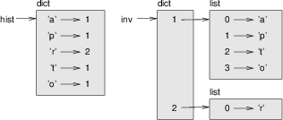
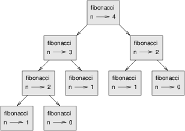

Dictionaries and other built-in data structures
***********************************************

.. todo:: fold tuples and sets into this chapter.

A **dictionary** is like a list, but more general. In a list, the
indices have to be integers; in a dictionary they can be (almost) any
type.

You can think of a dictionary as a mapping between a set of indices
(which are called **keys**) and a set of values. Each key maps to a
value. The association of a key and a value is called a **key-value
pair** or sometimes an **item**. Because of the way that dictionaries
work, they're also called associative arrays.

As an example, we’ll build a dictionary that maps from English to
Spanish words, so the keys and the values are all strings.

The function ``dict`` creates a new dictionary with no items. Because
``dict`` is the name of a built-in function, you should avoid using it
as a variable name.

.. code-block:: python

    >>> eng2sp = dict()
    >>> print eng2sp
    {}

The squiggly-brackets, ``{}``, represent an empty dictionary. To add
items to the dictionary, you can use square brackets:

.. code-block:: python

    >>> eng2sp['one'] = 'uno'

This line creates an item that maps from the key ``'one'`` to the value
``'uno'``. If we print the dictionary again, we see a key-value pair
with a colon between the key and value:

.. code-block:: python

    >>> print eng2sp
    {'one': 'uno'}

This output format is also an input format. For example, you can create
a new dictionary with three items:

.. code-block:: python

    >>> eng2sp = {'one': 'uno', 'two': 'dos', 'three': 'tres'}

But if you print ``eng2sp``, you might be surprised:

.. code-block:: python

    >>> print eng2sp
    {'one': 'uno', 'three': 'tres', 'two': 'dos'}

The order of the key-value pairs is not the same. In fact, if you type
the same example on your computer, you might get a different result. In
general, the order of items in a dictionary is unpredictable.

But that’s not a problem because the elements of a dictionary are never
indexed with integer indices. Instead, you use the keys to look up the
corresponding values:

.. code-block:: python

    >>> print eng2sp['two']
    'dos'

The key ``'two'`` always maps to the value ``'dos'`` so the order of the
items doesn’t matter.

If the key isn’t in the dictionary, you get an exception:

.. code-block:: python

    >>> print eng2sp['four']
    KeyError: 'four'

The ``len`` function works on dictionaries; it returns the number of
key-value pairs:

.. code-block:: python

    >>> len(eng2sp)
    3

The ``in`` operator works on dictionaries; it tells you whether
something appears as a *key* in the dictionary (appearing as a value is
not good enough).

.. code-block:: python

    >>> 'one' in eng2sp
    True
    >>> 'uno' in eng2sp
    False

To see whether something appears as a value in a dictionary, you can use
the method ``values``, which returns the values as a list, and then use
the ``in`` operator:

.. code-block:: python

    >>> vals = eng2sp.values()
    >>> 'uno' in vals
    True

The ``in`` operator uses different algorithms for lists and
dictionaries. For lists, it uses a search algorithm, as in the ``find``
function we wrote earlier. As the list gets longer, the search time gets
longer in direct proportion. For dictionaries, Python uses an algorithm
called a **hashtable** that has a remarkable property: the ``in``
operator takes about the same amount of time no matter how many items
there are in a dictionary. I won’t explain how that’s possible, but you
can read more about it at http://wikipedia.org/wiki/Hash_table.

    **Example**:

    1. Write a function that reads the words in ``words.txt`` and stores
       them as keys in a dictionary. It doesn’t matter what the values
       are. Then you can use the ``in`` operator as a fast way to check
       whether a string is in the dictionary.

Dictionary as a set of counters
-------------------------------

Suppose you are given a string and you want to count how many times each
letter appears. There are several ways you could do it:

1. You could create 26 variables, one for each letter of the alphabet.
   Then you could traverse the string and, for each character, increment
   the corresponding counter, probably using a chained conditional.

2. You could create a list with 26 elements. Then you could convert each
   character to a number (using the built-in function ``ord``), use the
   number as an index into the list, and increment the appropriate
   counter.

3. You could create a dictionary with characters as keys and counters as
   the corresponding values. The first time you see a character, you
   would add an item to the dictionary. After that you would increment
   the value of an existing item.

Each of these options performs the same computation, but each of them
implements that computation in a different way.

An **implementation** is a way of performing a computation; some
implementations are better than others. For example, an advantage of the
dictionary implementation is that we don’t have to know ahead of time
which letters appear in the string and we only have to make room for the
letters that do appear.

Here is what the code might look like:

.. code-block:: python

    def histogram(s):
        d = dict()
        for c in s:
            if c not in d:
                d[c] = 1
            else:
                d[c] += 1
        return d

The name of the function is **histogram**, which is a statistical term
for a set of counters (or frequencies).

The first line of the function creates an empty dictionary. The ``for``
loop traverses the string. Each time through the loop, if the character
``c`` is not in the dictionary, we create a new item with key ``c`` and
the initial value 1 (since we have seen this letter once). If ``c`` is
already in the dictionary we increment ``d[c]``.

Here’s how it works:

.. code-block:: python

    >>> h = histogram('brontosaurus')
    >>> print h
    {'a': 1, 'b': 1, 'o': 2, 'n': 1, 's': 2, 'r': 2, 'u': 2, 't': 1}

The histogram indicates that the letters ``'a'`` and ``'b'`` appear
once; ``'o'`` appears twice, and so on.

**Example**:

    1. Dictionaries have a method called ``get`` that takes a key and a
       default value. If the key appears in the dictionary, ``get``
       returns the corresponding value; otherwise it returns the default
       value. For example:

.. code-block:: python

           >>> h = histogram('a')
           >>> print h
           {'a': 1}
           >>> h.get('a', 0)
           1
           >>> h.get('b', 0)
           0

..

       Use ``get`` to write ``histogram`` more concisely. You should be
       able to eliminate the ``if`` statement.

Looping and dictionaries
------------------------

If you use a dictionary in a ``for`` statement, it traverses the keys of
the dictionary. For example, ``print_hist`` prints each key and the
corresponding value:

.. code-block:: python

    def print_hist(h):
        for c in h:
            print c, h[c]

Here’s what the output looks like:

.. code-block:: python

    >>> h = histogram('parrot')
    >>> print_hist(h)
    a 1
    p 1
    r 2
    t 1
    o 1

Again, the keys are in no particular order.

    **Example**:

    1. Dictionaries have a method called ``keys`` that returns the keys
       of the dictionary, in no particular order, as a list.

       Modify ``print_hist`` to print the keys and their values in
       alphabetical order.

Reverse lookup
--------------

Given a dictionary ``d`` and a key ``k``, it is easy to find the
corresponding value ``v = d[k]``. This operation is called a **lookup**.

But what if you have ``v`` and you want to find ``k``? You have two
problems: first, there might be more than one key that maps to the value
``v``. Depending on the application, you might be able to pick one, or
you might have to make a list that contains all of them. Second, there
is no simple syntax to do a **reverse lookup**; you have to search.

Here is a function that takes a value and returns the first key that
maps to that value:

.. code-block:: python

    def reverse_lookup(d, v):
        for k in d:
            if d[k] == v:
                return k
        raise ValueError

This function is yet another example of the search pattern, but it uses
a feature we haven’t seen before, ``raise``. The ``raise`` statement
causes an exception; in this case it causes a ``ValueError``, which
generally indicates that there is something wrong with the value of a
parameter.

If we get to the end of the loop, that means ``v`` doesn’t appear in the
dictionary as a value, so we raise an exception.

Here is an example of a successful reverse lookup:

.. code-block:: python

    >>> h = histogram('parrot')
    >>> k = reverse_lookup(h, 2)
    >>> print k
    r

And an unsuccessful one:

.. code-block:: python

    >>> k = reverse_lookup(h, 3)
    Traceback (most recent call last):
      File "<stdin>", line 1, in ?
      File "<stdin>", line 5, in reverse_lookup
    ValueError

The result when you raise an exception is the same as when Python raises
one: it prints a traceback and an error message.

The ``raise`` statement takes a detailed error message as an optional
argument. For example:

.. code-block:: python

    >>> raise ValueError, 'value does not appear in the dictionary'
    Traceback (most recent call last):
      File "<stdin>", line 1, in ?
    ValueError: value does not appear in the dictionary

A reverse lookup is much slower than a forward lookup; if you have to do
it often, or if the dictionary gets big, the performance of your program
will suffer.

    **Example**:

    1. Modify ``reverse_lookup`` so that it builds and returns a list of
       *all* keys that map to ``v``, or an empty list if there are none.

Dictionaries and lists
----------------------

Lists can appear as values in a dictionary. For example, if you were
given a dictionary that maps from letters to frequencies, you might want
to invert it; that is, create a dictionary that maps from frequencies to
letters. Since there might be several letters with the same frequency,
each value in the inverted dictionary should be a list of letters.

Here is a function that inverts a dictionary:

.. code-block:: python

    def invert_dict(d):
        inv = dict()
        for key in d:
            val = d[key]
            if val not in inv:
                inv[val] = [key]
            else:
                inv[val].append(key)
        return inv

Each time through the loop, ``key`` gets a key from ``d`` and ``val``
gets the corresponding value. If ``val`` is not in ``inv``, that means
we haven’t seen it before, so we create a new item and initialize it
with a **singleton** (a list that contains a single element). Otherwise
we have seen this value before, so we append the corresponding key to
the list.

Here is an example:

.. code-block:: python

    >>> hist = histogram('parrot')
    >>> print hist
    {'a': 1, 'p': 1, 'r': 2, 't': 1, 'o': 1}
    >>> inv = invert_dict(hist)
    >>> print inv
    {1: ['a', 'p', 't', 'o'], 2: ['r']}

And here is a diagram showing ``hist`` and ``inv``:



   The dictionary ``hist`` and its "inverted" equivalent ``inv``.

A dictionary is represented as a box with the type ``dict`` above it and
the key-value pairs inside. If the values are integers, floats or
strings, I usually draw them inside the box, but I usually draw lists
outside the box, just to keep the diagram simple.

Lists can be values in a dictionary, as this example shows, but they
cannot be keys. Here’s what happens if you try:

.. code-block:: python

    >>> t = [1, 2, 3]
    >>> d = dict()
    >>> d[t] = 'oops'
    Traceback (most recent call last):
      File "<stdin>", line 1, in ?
    TypeError: list objects are unhashable

I mentioned earlier that a dictionary is implemented using a hashtable
and that means that the keys have to be **hashable**.

A **hash** is a function that takes a value (of any kind) and returns an
integer. Dictionaries use these integers, called hash values, to store
and look up key-value pairs.

This system works fine if the keys are immutable. But if the keys are
mutable, like lists, bad things happen. For example, when you create a
key-value pair, Python hashes the key and stores it in the corresponding
location. If you modify the key and then hash it again, it would go to a
different location. In that case you might have two entries for the same
key, or you might not be able to find a key. Either way, the dictionary
wouldn’t work correctly.

That’s why the keys have to be hashable, and why mutable types like
lists aren’t. The simplest way to get around this limitation is to use
tuples, which we will see in the next chapter.

Since dictionaries are mutable, they can’t be used as keys, but they
*can* be used as values.

Memos
-----

If you played with the ```fibonacci`` function <#sec:fibonacci>`_, you
might have noticed that the bigger the argument you provide, the longer
the function takes to run. Furthermore, the run time increases very
quickly.

To understand why, consider this **call graph** for ``fibonacci`` with
``n=4``:



   Fibonacci function call graph.

A call graph shows a set of function frames, with lines connecting each
frame to the frames of the functions it calls. At the top of the graph,
``fibonacci`` with ``n=4`` calls ``fibonacci`` with ``n=3`` and ``n=2``.
In turn, ``fibonacci`` with ``n=3`` calls ``fibonacci`` with ``n=2`` and
``n=1``. And so on.

Count how many times ``fibonacci(0)`` and ``fibonacci(1)`` are called.
This is an inefficient solution to the problem, and it gets worse as the
argument gets bigger.

One solution is to keep track of values that have already been computed
by storing them in a dictionary. A previously computed value that is
stored for later use is called a **memo**\  [1]_. Here is an
implementation of ``fibonacci`` using memos:

.. code-block:: python

    known = {0:0, 1:1}

    def fibonacci(n):
        if n in known:
            return known[n]

        res = fibonacci(n-1) + fibonacci(n-2)
        known[n] = res
        return res

``known`` is a dictionary that keeps track of the Fibonacci numbers we
already know. It starts with two items: 0 maps to 0 and 1 maps to 1.

Whenever ``fibonacci`` is called, it checks ``known``. If the result is
already there, it can return immediately. Otherwise it has to compute
the new value, add it to the dictionary, and return it.

    **Example**:

    1. Run this version of ``fibonacci`` and the original with a range
       of parameters and compare their run times.

Debugging
---------

As you work with bigger datasets it can become unwieldy to debug by
printing and checking data by hand. Here are some suggestions for
debugging large datasets:

-  Scale down the input:

   -  If possible, reduce the size of the dataset. For example if the
      program reads a text file, start with just the first 10 lines, or
      with the smallest example you can find. You can either edit the
      files themselves, or (better) modify the program so it reads only
      the first ``n`` lines.

   -  If there is an error, you can reduce ``n`` to the smallest value
      that manifests the error, and then increase it gradually as you
      find and correct errors.

-  Check summaries and types:

   -  Instead of printing and checking the entire dataset, consider
      printing summaries of the data: for example, the number of items
      in a dictionary or the total of a list of numbers.

   -  A common cause of runtime errors is a value that is not the right
      type. For debugging this kind of error, it is often enough to
      print the type of a value.

-  Write self-checks:

   -  Sometimes you can write code to check for errors automatically.
      For example, if you are computing the average of a list of
      numbers, you could check that the result is not greater than the
      largest element in the list or less than the smallest. This is
      called a “sanity check” because it detects results that are
      “insane.”

   -  Another kind of check compares the results of two different
      computations to see if they are consistent. This is called a
      “consistency check.”

Again, time you spend building scaffolding can reduce the time you spend
debugging.

.. rubric:: Glossary

dictionary:
    A mapping from a set of keys to their corresponding values.

key-value pair:
    The representation of the mapping from a key to a value.

item:
    Another name for a key-value pair.

key:
    An object that appears in a dictionary as the first part of a
    key-value pair.

value:
    An object that appears in a dictionary as the second part of a
    key-value pair. This is more specific than our previous use of the
    word “value.”

implementation:
    A way of performing a computation.

hashtable:
    The algorithm used to implement Python dictionaries.

hash function:
    A function used by a hashtable to compute the location for a key.

hashable:
    A type that has a hash function. Immutable types like integers,
    floats and strings are hashable; mutable types like lists and
    dictionaries are not.

lookup:
    A dictionary operation that takes a key and finds the corresponding
    value.

reverse lookup:
    A dictionary operation that takes a value and finds one or more keys
    that map to it.

singleton:
    A list (or other sequence) with a single element.

call graph:
    A diagram that shows every frame created during the execution of a
    program, with an arrow from each caller to each callee.

histogram:
    A set of counters.

memo:
    A computed value stored to avoid unnecessary future computation.

.. rubric:: Exercises

1. Use a dictionary to write a faster, simpler version of
   ``has_duplicates``. This function should take a list as a
   parameter and return ``True`` if there is any object that appears
   more than once in the list.

2. Two words are "rotate pairs" if you can rotate one of them and
   get the other.

   Write a program that reads a wordlist and finds all the rotate
   pairs.

3. Here’s another Puzzler from *Car Talk*\  [2]_:

   "This was sent in by a fellow named Dan O’Leary. He came upon a
   common one-syllable, five-letter word recently that has the
   following unique property. When you remove the first letter, the
   remaining letters form a homophone of the original word, that is
   a word that sounds exactly the same. Replace the first letter,
   that is, put it back and remove the second letter and the result
   is yet another homophone of the original word. And the question
   is, what’s the word?

   "Now I’m going to give you an example that doesn’t work. Let’s
   look at the five-letter word, ‘wrack.’ W-R-A-C-K, you know like
   to ‘wrack with pain.’ If I remove the first letter, I am left
   with a four-letter word, ’R-A-C-K.’ As in, ‘Holy cow, did you see
   the rack on that buck! It must have been a nine-pointer!’ It’s a
   perfect homophone. If you put the ‘w’ back, and remove the ‘r,’
   instead, you’re left with the word, ‘wack,’ which is a real word,
   it’s just not a homophone of the other two words.

   "But there is, however, at least one word that Dan and we know
   of, which will yield two homophones if you remove either of the
   first two letters to make two, new four-letter words. The
   question is, what’s the word?"

   To check whether two words are homophones, you can use the CMU
   Pronouncing Dictionary. You can download it from
   http://www.speech.cs.cmu.edu/cgi-bin/cmudict. (The file you're
   looking for is a text file named ``cmudict.0.7a``.)

   Write a program that lists all the words that solve the Puzzler.

.. rubric:: Footnotes

.. [1]
   See http://wikipedia.org/wiki/Memoization.

.. [2]
   http://www.cartalk.com/content/puzzler/transcripts/200717.
