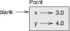

Classes and objects
*******************

We have used many of Python’s built-in types, like integers, strings, and
lists. Each instance of a type in Python (e.g., a
specific string, integer, or list) is called an **object**. Although the
term "object" sounds generic, it has a very specific meaning in software
design. In fact, what we'll be learning about in this chapter is a style
of programming and program design called **object-oriented
programming**, or OOP. Before we get into designing an object-oriented
program, we will first learn about how new types --- and new types of
objects --- can be defined and created.

User-defined types
------------------

As an initial example, we'll create a new type called ``Point`` that
represents a point in two-dimensional space. In mathematical notation,
points are often written in parentheses with a comma separating the
coordinates. For example, :math:`(0, 0)` represents the origin, and
:math:`(x, y)` represents the point :math:`x` units to the right and
:math:`y` units up from the origin.

There are several ways we might represent points in Python:

-  We could store the coordinates separately in two variables, ``x`` and
   ``y``.

-  We could store the coordinates as elements in a list or tuple.

-  We could create a dictionary that has two keys, ``x`` and ``y``, with
   corresponding values.

-  We could create a *new type* to represent points as objects.
    (Woo-hoo! Pick me! Pick me!)

Creating a new type is (a little bit) more complicated than the other
options, but it has advantages that will be apparent soon.

Every type in Python is defined by the type's **class**. You can think
of a class as a blueprint or model from which objects can be created. A
minimal class definition looks like this:

.. code-block:: python

    class Point(object):
        """represents a point in 2-D space"""

This header indicates that the new class is a ``Point``, which is a kind
of ``object``, which is a built-in type.

The body is a docstring that explains the purpose of the class.
Normally, you will also define functions and variables inside a class
definition; we will get to that shortly.

Defining a class named ``Point`` creates a class object.

.. code-block:: python

    >>> print Point
    <class '__main__.Point'>

Because ``Point`` is defined at the top level, its "full name" is
``__main__.Point``.

Besides being like a blueprint, the class object is also like a factory
for creating objects. To create a Point, you call ``Point`` as if it
were a function.

.. code-block:: python

    >>> blank = Point()
    >>> print blank
    <__main__.Point instance at 0xb7e9d3ac>

The return value is a reference to a Point object, which we assign to
``blank``. Creating a new object is called **instantiation**, and the
object is an **instance** of the class.

When you print an instance, Python tells you what class it belongs to
and where it is stored in memory (the string starting ``0x`` is a memory
location in hexadecimal format---base 16).

Even though it might feel a little strange using the class name as a
function, you can construct any built-in Python type using the same
syntax:

.. code-block:: python

    >>> mylist = list()
    >>> print list
    []

Using the class/type name as a function works for *any* type in Python:
``int``, ``str``, ``list``, ``dict``, ``tuple``, etc. And although
printing the ``list`` object looks a little prettier than our ``Point``
object, we'll make the ``Point`` look better soon.

Attributes and Methods
----------------------

We've just made a ``Point`` class from which we can construct ``Point``
instances, or ``Point`` objects. Objects, in the peculiar programming
language sense, can have **attributes** and **methods** associated with
them.

-  You can think of the **attributes** as data, or information, stored
   inside an object. In object-oriented programming languages,
   attributes are also referred to as **instance variables**.

-  We've already used **methods** on objects. These are functions that
   are, in a sense, *attached* to an object. In Python, a method is
   invoked by using the dot notation syntax::

       >>> # object.method(parameters)
       >>> s = "aabbcc"
       >>> s.count('b')
       2

In the above example with the string object ``s``, we invoke the
``count`` method on the object, passing the string ``b`` as a parameter.
You can think of the attributes for the string object as being the
sequence of characters that make up the string.

Adding attributes
~~~~~~~~~~~~~~~~~

You can assign new attributes to an instance using dot notation and the
assignment operator:

.. code-block:: python

    >>> blank = Point()
    >>> blank.x = 3.0
    >>> blank.y = 4.0

The following diagram shows the result of these assignments. A state
diagram that shows an object and its attributes is called an **object
diagram**:

   Class diagram of a ``point`` object.

The variable ``blank`` refers to a Point object, which contains two
attributes. Each attribute refers to a floating-point number.

You can read the value of an attribute using the same syntax:

.. code-block:: python

    >>> print blank.y
    4.0
    >>> x = blank.x
    >>> print x
    3.0

The expression ``blank.x`` means, "Go to the object ``blank`` refers to
and get the value of ``x``." In this case, we assign that value to a
variable named ``x``. There is no conflict between the variable ``x``
and the attribute ``x``.

Interestingly (and usefully), *objects are mutable* --- we can change
the values of attributes:

.. code-block:: python

    >>> blank.x = 5.5
    >>> blank.y = blank.x * 2

Adding methods
~~~~~~~~~~~~~~

Methods are semantically the same as functions, but there are two
syntactic differences:

-  Methods are defined inside a class definition in order to make the
   relationship between the class and the method explicit. As with
   functions, we use the ``def`` keyword to define methods, but the
   method ``def`` header needs to be indented inside the class
   definition.

-  The syntax for invoking a method is different from the syntax for
   calling a function.

Let's get started writing a method to set the ``x`` and ``y`` attributes
in the object to new values:

.. code-block:: python

    class Point(object):
        '''represents a point in 2-D space'''

        def setXY(point, x, y):
            '''Set values for x and y attributes.
               Parameters:
                  point is the object we're invoking this method on.
                  x is the new value for the x attribute.
                  y is the new value for the y attribute.
               There's no return value.'''
            point.x = x
            point.y = y

We might use our ``Point`` class to create an object and set its ``x``
and ``y`` attributes using the ``setXY`` method as follows:

.. code-block:: python

    >>> p = Point()
    >>> p.setXY(8.0, 7.5)
    >>> print p.x
    8.0
    >>> print p.y
    7.5

On line 2 of the above code, ``setXY`` is the name of the method, and
``p`` is the object on which the method is invoked, which is also called
the **subject**. Just as the subject of a sentence is what the sentence
is about, the subject of a method invocation is what the method is
about.

Inside the ``setXY`` method, the subject is assigned to the first
parameter, so in this case ``p`` is assigned to ``point``.

By convention in Python, the first parameter of a method is called
``self``, so the Pythonically correct way to write ``setXY`` would be:

.. code-block:: python

    class Point(object):
        '''represents a point in 2-D space'''

        def setXY(self, x, y):
            '''Set values for x and y attributes.'''
            self.x = x
            self.y = y

The init method
~~~~~~~~~~~~~~~

Instead of making a ``setXY`` method to initialize the attributes of our
``Point`` class, a more conventional way to set initial attribute values
is to create a special method called the **constructor**, **c'tor**, or
**initializer**. The method name for the constructor is *always*
``__init__`` in Python, and it is automatically invoked when an object
is instantiated. Constructors are used for initializing attributes in an
object, and to perform any other initialization that might be required
when a new instance is created.

Let's modify our ``Point`` class to include an ``__init__`` method that
accepts two parameters for initializing our ``x`` and ``y`` coordinates.
We'll still retain the ``setXY`` method, too.

.. code-block:: python

    class Point(object):
        '''represents a point in 2-D space'''

        def __init__(self, x, y):
            '''Point constructor: takes initial x,y values'''
            self.x = x
            self.y = y

        def setXY(self, x, y):
            self.x = x
            self.y = y

To create a new ``Point`` object, we have to change our call to
``Point`` to pass in initial values for ``x`` and ``y``:

.. code-block:: python

    >>> p = Point(3.2, 8.9)
    >>> print p.x
    3.2
    >>> print p.y
    8.9

Since ``__init__`` and ``setXY`` are nearly identical, we could even
refine our code a bit to reduce redundancy:

.. code-block:: python

    class Point(object):
        '''represents a point in 2-D space'''

        def __init__(self, x, y):
            '''Point constructor: sets initial x,y values'''
            self.setXY(x, y)

        def setXY(self, x, y):
            self.x = x
            self.y = y

The optimization isn't particularly large in this example, but it is
still a good idea to avoid repeating the same code. Also, if we add any
new attributes, we only have to specify their initialization in *one*
place.

Additional ``Point`` methods
~~~~~~~~~~~~~~~~~~~~~~~~~~~~

Let's add to our ``Point`` class by writing two more methods:

-  A ``getXY`` method that doesn't take any parameters and returns a
   tuple consisting of the ``x`` and ``y`` coordinates, and

-  a ``distance`` method that takes another ``Point`` object as a
   parameter and computes and returns the Euclidean distance between the
   *subject* ``Point`` (the ``Point`` object on which the ``distance``
   method is called) and the ``Point`` object passed as the parameter.

First, the ``getXY`` method:

.. code-block:: python

    class Point(object):

        # ... other methods defined in Point

        def getXY(self):
            ''' return the x,y coordinates
                as a tuple.'''
            return (self.x, self.y)

Although we said about that the ``getXY`` method doesn't take any
parameters, *all* methods must *always* take at least one parameter: the
subject, or ``self`` object. Inside the method, we simply return a tuple
consisting of the ``x`` and ``y`` components.

In a program, we might use the ``getXY`` method as follows:

.. code-block:: python

    >>> p = Point(5,2)
    >>> coord_tuple = p.getXY()
    >>> print coord_tuple
    (5,2)    

Now, for the ``distance`` method:

.. code-block:: python

    import math

    class Point(object):

        # ... other methods defined in Point

        def distance(self, other):
            ''' compute and return the Euclidean
                distance between this point and another.'''
            d = (self.x - other.x)**2 + (self.y - other.y)**2
            return math.sqrt(d)

In a program, we might use the ``distance`` method as follows:

.. code-block:: python

    >>> p1 = Point(5,1)
    >>> p2 = Point(3,7)
    >>> d = p1.distance(p2)
    >>> print d
    6.324555320336759

Printing objects
~~~~~~~~~~~~~~~~

``__str__`` is a special method, like ``__init__``, that is supposed to
return a string representation of an object. For the ``Point`` class, we
might write the ``__str__`` method as follows:

.. code-block:: python

    class Point(object):

        # ... other methods defined in Point

        def __str__(self):
            return "Point ({:.1f},{:.1f})".format(self.x, self.y)

When you ``print`` an object, Python automatically and implicitly
invokes the ``__str__`` method:

.. code-block:: python

    >>> print p1
    'Point (5.0,1.0)'
    >>> print p2
    Point (3.0,7.0)

When you write a new class, a good idea is to start by writing
``__init__``, which makes it easier to instantiate objects, and
``__str__``, which is useful for debugging.

Note that any method names that are prefixed and suffixed with ``__``
are called **magic methods** in Python. They're "magic" because they're
invoked automatically and implicitly by Python: a programmer generally
never explicitly invokes these methods.

The full ``Point`` class
~~~~~~~~~~~~~~~~~~~~~~~~

Putting all our work together, here is the full definition of the
``Point`` class that we created:

.. code-block:: python

    import math

    class Point(object):
        '''represents a point in 2-D space'''

        def __init__(self, x, y):
            '''Point constructor: takes initial x,y values'''
            self.x = x
            self.y = y

        def setXY(self, x, y):
            '''Set x and y coordinates to new values.'''
            self.x = x
            self.y = y

        def getXY(self):
            ''' return the x,y coordinates as a tuple.'''
            return (self.x, self.y)

        def distance(self, other):
            ''' compute and return the Euclidean
                distance between this point and another.'''
            d = (self.x - other.x)**2 + (self.y - other.y)**2
            return math.sqrt(d)

        def __str__(self):
            return "Point ({:.1f},{:.1f})".format(self.x, self.y)

.. rubric:: Glossary

.. todo:: copy stuff from oodesign

.. rubric:: Exercises

.. todo:: Add exercises

.. rubric:: Footnotes

