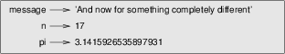

*************************************
Variables, expressions and statements
*************************************

Values and types
----------------

A **value** is one of the basic things a program works with, like a
letter or a number. The values we have seen so far are the numbers
``1``, and ``2``, and the phrase ``'Hello, World!'``.

These values belong to different **types**: ``2`` is an integer, and
``'Hello, World!'`` is a **string**, so-called because it contains a
"string", or sequence, of letters. You (and the interpreter) can
identify strings because they are enclosed in quotation marks. (Note
that you can use both single and double quotes to enclose a Python
string. More on strings soon.)

The print statement works as you might expect for integers.

::

    >>> print 4
    4

If you are not sure what type a value has, the interpreter can tell you.

::

    >>> type('Hello, World!')
    <type 'str'>
    >>> type(17)
    <type 'int'>

Not surprisingly, strings belong to the type ``str`` and integers belong
to the type ``int``. Less obviously, numbers with a decimal point belong
to a type called ``float``, because these numbers are represented in a
format called **floating-point**.

::

    >>> type(3.2)
    <type 'float'>

What about values like ``'17'`` and ``'3.2'``? They look like numbers,
but they are in quotation marks like strings.

::

    >>> type('17')
    <type 'str'>
    >>> type('3.2')
    <type 'str'>

They're strings.

When you type a large integer, you might be tempted to use commas
between groups of three digits, as in ``1,000,000``. This is not a legal
integer in Python, but it is still legal:

::

    >>> print 1,000,000
    1 0 0

Well, that's not what we expected at all! Python interprets
``1,000,000`` as a comma-separated sequence of integers, which it prints
with spaces between.

This is the first example we have seen of a semantic error: the code
runs without producing an error message, but it doesn't do the "right"
thing.

Variables
---------

One of the most powerful features of a programming language is the
ability to manipulate **variables**. A variable is a name that refers to
a value. Another way to think of a variable is as a *named storage
location in memory*.

An **assignment statement** creates new variables and gives them values:

::

    >>> message = 'And now for something completely different'
    >>> n = 17
    >>> pi = 3.1415926535897931

This example makes three assignments. The first assigns a string to a
new variable named ``message``; the second gives the integer ``17`` to
``n``; the third assigns the (approximate) value of :math:`\pi` to
``pi``.

A common way to represent variables on paper is to write the name with
an arrow pointing to the variable's value. This kind of figure is called
a **state diagram** because it shows what state each of the variables is
in (think of it as the variable's state of mind). This diagram shows the
result of the previous example:

   Variable assignment examples.

To display the value of a variable, you can use a print statement:

::

    >>> print n
    17
    >>> print pi
    3.14159265359

The type of a variable is the type of the value it refers to.

::

    >>> type(message)
    <type 'str'>
    >>> type(n)
    <type 'int'>
    >>> type(pi)
    <type 'float'>

    **Example**:

    1. If you type an integer with a leading zero, you might get a
       confusing error:

                   zipcode = 02492 ^ SyntaxError: invalid token

    Other numbers seem to work, but the results are bizarre:

    ::

        >>> zipcode = 02132
        >>> print zipcode
        1114

    Can you figure out what is going on? Hint: print the values ``01``,
    ``010``, ``0100`` and ``01000``.

Variable names and keywords
---------------------------

Programmers generally choose names for their variables that are
meaningful --- they document what the variable is used for.

Variable names can be arbitrarily long. They can contain both letters
and numbers, but they have to begin with a letter. It is legal to use
uppercase letters, but it is a good idea to begin variable names with a
lowercase letter. (Beginning a variable name with an upper-case letter
is often only done is certain situations, which we won't see until a bit
later.)

The underscore character (``_``) can appear in a name. It is often used
in names with multiple words, such as ``my_name`` or
``airspeed_of_unladen_swallow``.

If you give a variable an illegal name, you get a syntax error:

::

    >>> 76trombones = 'big parade'
    SyntaxError: invalid syntax
    >>> more@ = 1000000
    SyntaxError: invalid syntax
    >>> class = 'Advanced Theoretical Zymurgy'
    SyntaxError: invalid syntax

``76trombones`` is illegal because it does not begin with a letter.
``more@`` is illegal because it contains an illegal character, ``@``.
But what's wrong with ``class``?

It turns out that ``class`` is one of Python's **keywords**. The
interpreter uses keywords to recognize the structure of the program, and
they cannot be used as variable names.

Python version 2 (which is what we're using) has 31 keywords [1]_:

::

    and       del       from      not       while    
    as        elif      global    or        with     
    assert    else      if        pass      yield    
    break     except    import    print              
    class     exec      in        raise              
    continue  finally   is        return             
    def       for       lambda    try

You might want to keep this list handy. If the interpreter complains
about one of your variable names and you don't know why, see if it is on
this list.

Statements
----------

A statement is a unit of code that the Python interpreter can execute.
We have seen two kinds of statements: print and assignment.

When you type a statement in interactive mode, the interpreter executes
it and displays the result, if there is one.

A script usually contains an ordered sequence of statements. If there is
more than one statement, the results appear one at a time as the
statements *execute*, or run. In all the scripts we will see for now,
statements execute one after another, top to bottom, just as you would
normally read a page in English.

For example, the script

::

    print 1
    x = 2
    print x
    print 1,x

produces the output

::

    1
    2
    1 2

The assignment statement produces no output. The last statement prints
the literal integer ``1`` followed by a space, followed by the value
referred to by the variable ``x``. You can use commas to separate items
to be printed in a ``print`` statement; Python will include spaces
between each item (and the commas will not be shown in the output).

Operators and operands
----------------------

**Operators** are special symbols that represent computations like
addition and multiplication. The values the operator is applied to are
called **operands**.

The operators ``+``, ``-``, ``*``, ``/`` and ``**`` perform addition,
subtraction, multiplication, division and exponentiation, as in the
following examples:

::

    20+32   
    hour-1   
    hour*60+minute   
    minute/60   
    5**2   
    (5+9)*(15-7)

In some other languages, ``^`` is used for exponentiation, but in Python
it is a bitwise operator called XOR. Bitwise operators will not be
covered in this book, but you can read about them at
http://wiki.python.org/moin/BitwiseOperators.

The division operator might not do what you expect:

::

    >>> minute = 59
    >>> minute/60
    0

The value of ``minute`` is 59, and in conventional arithmetic 59 divided
by 60 is 0.98333, not 0 . The reason for the discrepancy is that Python
is performing **floor division**\  [2]_.

When both of the operands are integers, the result is also an integer;
floor division chops off the fraction part, so in this example it rounds
down to zero.

If either of the operands is a floating-point number, Python performs
floating-point division, and the result is a ``float``:

::

    >>> minute/60.0
    0.98333333333333328

If you *want* floor division and you are working with floating point
operands, you can use the ``//`` operator to perform integer division:

::

    >>> minute // 60.0
    0.0

The resulting type from ``//`` follows the same rule as with the
"regular" division operator (``/``): if both operands are integers, the
result is an integer, and if at least one operand is floating point, the
result is floating point.

Expressions
-----------

An **expression** is a combination of values, variables, and operators.
A value all by itself is considered an expression, and so is a variable,
so the following are all legal expressions (assuming that the variable
``x`` has been assigned a value):

::

    17
    x
    x + 17

If you type an expression in interactive mode, the interpreter
**evaluates** it and displays the result:

::

    >>> 1 + 1
    2

But in a script, an expression all by itself doesn’t do anything! If you
want to show output to the screen, you must use a ``print`` statement.
This is a common source of confusion for beginners.

    **Examples**:

    1. Type the following statements in the Python interpreter to see
       what they do:

       ::

           5
           x = 5
           x + 1

    2. Now put the same statements into a script and run it. What is the
       output? Modify the script by transforming each expression into a
       print statement and then run it again.

Order of operations
-------------------

When more than one operator appears in an expression, the order of
evaluation depends on the **rules of precedence**. For mathematical
operators, Python follows mathematical convention. The acronym
**PEMDAS** is a useful way to remember the rules:

-  **P**\ arentheses have the highest precedence and can be used to
   force an expression to evaluate in the order you want. Since
   expressions in parentheses are evaluated first, ``2 * (3-1)`` is 4,
   and ``(1+1)**(5-2)`` is 8. You can also use parentheses to make an
   expression easier to read, as in ``(minute * 100) / 60``, even if it
   doesn't change the result.

-  **E**\ xponentiation has the next highest precedence, so ``2**1+1``
   is 3, not 4, and ``3*1**3`` is 3, not 27.

-  **M**\ ultiplication and **D**\ ivision have the same precedence,
   which is higher than **A**\ ddition and **S**\ ubtraction, which also
   have the same precedence. So ``2*3-1`` is 5, not 4, and ``6+4/2`` is
   8, not 5.

-  Operators with the same precedence are evaluated from left to right.
   So in the expression ``degrees / 2 * pi``, the division happens first
   and the result is multiplied by ``pi``. To divide by :math:`2 \pi`,
   you can use parentheses or write ``degrees / 2 / pi``.

String operations
-----------------

As mentioned above, strings in Python can be enclosed in single or
double quotes. The following two statements are equivalent:

::

    mystring = 'green eggs and spam'
    mystring = "green eggs and spam"

Sometimes you might need to create really long strings that span
multiple lines. You can use yet another quoting method for that:
*triple* quotes (three single quotes in a row). For example:

::

        mystring = '''
    green
    eggs 
    and
    spam
    '''

In general, you cannot perform mathematical operations on strings, even
if the strings look like numbers, so the following are illegal:

::

    '2'-'1'    'eggs'/'easy'    'third'*'a charm'

The ``+`` operator works with strings, but it might not do what you
expect: it performs **concatenation**, which means joining the strings
by glueing them end-to-end. For example:

::

    first = 'throat'
    second = 'warbler'
    print first + second

The output of this program is ``throatwarbler``.

The ``*`` operator also works on strings; it performs repetition. For
example, ``'Spam'*3`` is ``'SpamSpamSpam'``. If one of the operands is a
string, the other has to be an integer.

This use of ``+`` and ``*`` makes sense by analogy with addition and
multiplication. Just as ``4*3`` is equivalent to ``4+4+4``, we expect
``'Spam'*3`` to be the same as ``'Spam'+'Spam'+'Spam'``, and it is. On
the other hand, there is a significant way in which string concatenation
and repetition are different from integer addition and multiplication.
Can you think of a property that addition has that string concatenation
does not?

Reassignment
------------

It is legal to make more than one assignment to the same variable. A new
assignment makes an existing variable refer to a new value (and stop
referring to the old value).

::

    bruce = 5
    print bruce,
    bruce = 7
    print bruce

The output of this program is ``5 7``, because the first time ``bruce``
is printed, its value is 5, and the second time, its value is 7. The
comma at the end of the first ``print`` statement suppresses the
newline, which is why both outputs appear on the same line.

Here is what **reassignment** looks like in a state diagram:

.. figure:: figs/assign2.png
   :align: center
   :alt: Reassignment state diagram.

   Reassignment state diagram.

With reassignment it is especially important to distinguish between an
assignment operation and a statement of equality. Because Python uses
the equal sign (``=``) for assignment, it is tempting to interpret a
statement like ``a = b`` as a statement of equality. It is not!

First, equality is a symmetric relation and assignment is not. For
example, in mathematics, if :math:`a = 7` then :math:`7 = a`. But in
Python, the statement ``a = 7`` is legal and ``7 = a`` is not.

Furthermore, in mathematics, a statement of equality is either true or
false, for all time. If :math:`a = b` now, then :math:`a` will always
equal :math:`b`. In Python, an assignment statement can make two
variables equal, but they don’t have to stay that way:

::

    a = 5
    b = a    # a and b are now equal
    a = 3    # a and b are no longer equal

The third line changes the value of ``a`` but does not change the value
of ``b``, so they are no longer equal.

Although reassignment is frequently helpful, you should use it with
care. If the values of variables change frequently, it can make the code
difficult to read and debug.

You can also make multiple assignments on the same line:

::

    a = b = c = 5
    # a, b, and c each refer to the integer value 5    

You can read such a statement from right to left: the value of 5 is
assigned to ``c``, which is also assigned to ``b``, which is also
assigned to ``a``.

Updating variables
------------------

One of the most common forms of assignment is an **update**, where the
new value of the variable depends on the old.

::

    x = x+1

This means “get the current value of ``x``, add one, and then update
``x`` with the new value.”

If you try to update a variable that doesn’t exist, you get an error,
because Python evaluates the right side before it assigns a value to
``x``:

::

    >>> x = x+1
    NameError: name 'x' is not defined

Before you can update a variable, you have to **initialize** it, usually
with a simple assignment:

::

    >>> x = 0
    >>> x = x+1

Updating a variable by adding 1 is called an **increment**; subtracting
1 is called a **decrement**.

There are "convenience operators" built in to Python that make updating
variables slightly simpler, syntactically. For example:

::

    x += 2

does the same thing as

::

    x = x + 2

with a couple fewer keystrokes. Similar to ``+=``, there are ``-=``,
``*=``, and ``/=`` convenience operators. Many Pythonistas use these
convenience operators, so if you look at code posted on, for example,
*Stack Overflow* (http://stackoverflow.com/questions/tagged/python),
you'll often see these operators.

Comments
--------

As programs get bigger and more complicated, they get more difficult to
read. Formal languages are dense, and it is often difficult to look at a
piece of code and figure out what it is doing, or why.

For this reason, it is a good idea to add notes to your programs to
explain in natural language what the program is doing. These notes are
called **comments**, and they start with the ``#`` symbol:

::

    # compute the percentage of the hour that has elapsed
    percentage = (minute * 100) / 60

In this case, the comment appears on a line by itself. You can also put
comments at the end of a line:

::

    percentage = (minute * 100) / 60 # percentage of an hour

Everything from the ``#`` to the end of the line is ignored—it has no
effect on the program.

Comments are most useful when they document non-obvious features of the
code. It is reasonable to assume that the reader can figure out *what*
the code does; it is much more useful to explain *why*.

This comment is redundant with the code and useless:

::

    v = 5     # assign 5 to v

This comment contains useful information that is not in the code:

::

    v = 5     # velocity in meters/second. 

Good variable names can reduce the need for comments, but long names can
make complex expressions hard to read, so there is a tradeoff. It will
be important in all the programs you create in this class (even short
programs!) to carefully consider *variable name choices* and to *include
useful comments*. Both of these items are considered part of the
**documentation** of a program, and help humans (you and others) to
better understand the purpose and intent of a program.

Debugging
---------

At this point the syntax error you are most likely to make is an illegal
variable name, like ``class`` and ``yield``, which are keywords, or
``odd~job`` and ``US$``, which contain illegal characters.

If you put a space in a variable name, Python thinks it is two operands
without an operator:

::

    >>> bad name = 5
    SyntaxError: invalid syntax

For syntax errors, the error messages don't help much. The most common
messages are ``SyntaxError: invalid syntax`` and
``SyntaxError: invalid token``, neither of which is very informative.

The runtime error you are most likely to make is a "use before def";
that is, trying to use a variable before you have assigned a value. This
can happen if you spell a variable name wrong:

::

    >>> principal = 327.68
    >>> interest = principle * rate
    NameError: name 'principle' is not defined

Variables names are case sensitive, so ``LaTeX`` is not the same as
``latex``.

At this point the most likely cause of a semantic error is the order of
operations. For example, to evaluate :math:`\frac{1}{2 \pi}`, you might
be tempted to write

::

    >>> 1.0 / 2.0 * pi

But the division happens first, so you would get :math:`\pi / 2`, which
is not the same thing! There is no way for Python to know what you meant
to write, so in this case you don't get an error message; you just get
the wrong answer.

    Exercise:

    1. Rewrite the last expression (``1.0 / 2.0 * pi``) so that the
       correct answer is reached.

Glossary
--------

value:
    One of the basic units of data, like a number or string, that a
    program manipulates.

type:
    A category of values. The types we have seen so far are integers
    (type ``int``), floating-point numbers (type ``float``), and strings
    (type ``str``).

integer:
    A type that represents whole numbers.

floating-point:
    A type that represents numbers with fractional parts.

string:
    A type that represents sequences of characters.

variable:
    A name that refers to a value.

statement:
    A section of code that represents a command or action. So far, the
    statements we have seen are assignments and print statements.

assignment:
    A statement that assigns a value to a variable.

state diagram:
    A graphical representation of a set of variables and the values they
    refer to.

keyword:
    A reserved word that is used by the compiler to parse a program; you
    cannot use keywords like ``if``, ``def``, and ``while`` as variable
    names.

operator:
    A special symbol that represents a simple computation like addition,
    multiplication, or string concatenation.

operand:
    One of the values on which an operator operates.

floor division:
    The operation that divides two numbers and chops off the fraction
    part.

expression:
    A combination of variables, operators, and values that represents a
    single result value.

evaluate:
    To simplify an expression by performing the operations in order to
    yield a single value.

rules of precedence:
    The set of rules governing the order in which expressions involving
    multiple operators and operands are evaluated.

concatenate:
    To join two operands end-to-end.

reassignment:
    Making more than one assignment to the same variable during the
    execution of a program.

update:
    An assignment where the new value of the variable depends on the
    old.

comment:
    Information in a program that is meant for other programmers (or
    anyone reading the source code) and has no effect on the execution
    of the program.

Exercises
---------

    1. Assume that we execute the following assignment statements:

       ``width = 17``

       ``height = 12.0``

       ``delimiter = '.'``

       For each of the following expressions, write the value of the
       expression and the type (of the value of the expression).

       a. ``width/2``

       b. ``width/2.0``

       c. ``height/3``

       d. ``1 + 2 * 5``

       e. ``delimiter * 5``

       Use the Python interpreter to check your answers.

    2. Practice using the Python interpreter as a calculator:

       a. The volume of a sphere with radius :math:`r` is
          :math:`\frac{4}{3} \pi r^3`. What is the volume of a sphere
          with radius 5? Hint: 392.6 is wrong!

       b. Suppose the cover price of a book is $24.95, but bookstores
          get a 40% discount. Shipping costs $3 for the first copy and
          75 cents for each additional copy. What is the total wholesale
          cost for 60 copies?

       c. If I leave my house at 6:52 am and run 1 mile at an easy pace
          (8:15 per mile), then 3 miles at tempo (7:12 per mile) and 1
          mile at easy pace again, what time do I get home for
          breakfast?

    3. Consider the following two variable assignments:

       ::

              panicstring = "don't panic"
              answer = 42

       Write a Python statement to print the following:
       ``don't panic -- think 42``

    4. Consider a modern computer processor that runs at 2 GHz, which
       simply means "2 billion cycles per second". If the speed of light
       is 299, 792, 458 meters per second, how many centimeters does
       light travel in the time it takes a processor to execute one
       cycle? Write a one-line Python program to print the answer.

.. [1]
   In Python 3.0, ``exec`` is no longer a keyword, but ``nonlocal`` is.

.. [2]
   In Python 3.0, the result of this division is a ``float``.
