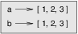
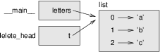

Advanced Strings and Lists
**************************

.. todo:: copy in stuff from lists; remove ord/chr; go into objects/methods
   pretty early in this section, setting up for next chapter.

In this chapter, we dive into a bit more depth on strings and lists.

Traversal with a ``while`` loop
-------------------------------

There are a number of situations in which a string must be processed one
character at a time. We've already done this with ``for`` loops, but
``while`` loops give us some additional flexibility. Often, we start at
the beginning, select each character in turn, do something to it, and
continue until the end. This pattern of processing is called a
**traversal**. For example:

.. code-block:: python

    index = 0
    while index < len(fruit):
        letter = fruit[index]
        print letter
        index += 1

This loop traverses the string and displays each letter on a line by
itself. The loop condition is ``index < len(fruit)``, so when ``index``
is equal to the length of the string, the condition is false, and the
body of the loop is not executed. The last character accessed is the one
with the index ``len(fruit)-1``, which is the last character in the
string.

    **Examples**

    1. Write a function that takes a string as an argument and displays
       the letters backward, one per line.

    2. Write a function that takes a string as an argument and displays
       the letters backward, all on the same line. (A space between
       letters is ok.)

    3. Write a function that takes a string as a parameter and returns
       the number of ``'x'``\ s that appear before the first ``'z'`` in
       the string. For example, calling the function with the string
       ``'xaxxyz! x?'`` should yield the count 3, since there are 3
       ``'x'``\ s that appear before the ``'z'`` in the string.

The following example shows how to use concatenation (string addition)
and a ``for`` loop to generate an abecedarian series (that is, in
alphabetical order). In Robert McCloskey’s book *Make Way for
Ducklings*, the names of the ducklings are Jack, Kack, Lack, Mack, Nack,
Ouack, Pack, and Quack. This loop outputs these names in order:

.. code-block:: python

    prefixes = 'JKLMNOPQ'
    suffix = 'ack'

    for letter in prefixes:
        print letter + suffix

The output is:

::

    Jack
    Kack
    Lack
    Mack
    Nack
    Oack
    Pack
    Qack

Of course, that’s not quite right because “Ouack” and “Quack” are
misspelled.

    **Examples**:

    1. Modify the program to fix this error.

    2. Modify the program to use a ``while`` loop instead of a ``for``
       loop.

String slices
-------------

A segment of a string is called a **slice**. Selecting a slice is
similar to selecting a character:

.. code-block:: python

    >>> s = 'Monty Python'
    >>> print s[0:5]
    Monty
    >>> print s[6:12]
    Python

The operator ``[n:m]`` returns the part of the string from the "n-eth"
character to the "m-eth" character, including the first but excluding
the last. This behavior is counterintuitive, but it might help to
imagine the indices pointing *between* the characters, as in the
following diagram:

If you omit the first index (before the colon), the slice starts at the
beginning of the string. If you omit the second index, the slice goes to
the end of the string:

.. code-block:: python

    >>> fruit = 'banana'
    >>> fruit[:3]
    'ban'
    >>> fruit[3:]
    'ana'

If the first index is greater than or equal to the second the result is
an **empty string**, represented by two quotation marks:

.. code-block:: python

    >>> fruit = 'banana'
    >>> fruit[3:3]
    ''

An empty string contains no characters and has length 0, but other than
that, it is the same as any other string.

Another way to slice a string is to use *three* indices. The third value
is referred to as the ``step``:

.. code-block:: python

    >>> fruit = 'banana'
    >>> fruit[0:5:2]
    'bnn'    

The three slice indices work similarly to the three arguments to the
``range`` function. In fact, you can think of the three slice parameters
as being used in a ``range`` function call to *generate* the indices of
values to be extracted ("sliced out") from the string. ``range(0,5,2)``
would give the list ``[0, 2, 4]``, so the slice yields a string composed
of the characters at indices 0, 2, and 4.

    **Example**:

    1. Given that ``fruit`` is a string, what does ``fruit[:]`` mean?

    2. Can you construct a string slice that will return a reversed copy
       of the string?

Strings are immutable
---------------------

It is tempting to use the ``[]`` operator on the left side of an
assignment, with the intention of changing a character in a string. For
example:

.. code-block:: python

    >>> greeting = 'Hello, world!'
    >>> greeting[0] = 'J'
    TypeError: object does not support item assignment

The "object" in this case is the string and the "item" is the character
you tried to assign. For now, an **object** is the same thing as a
value, but we will refine that definition later. An **item** is one of
the values in a sequence.

The reason for the error is that strings are **immutable**, which means
you can’t change an existing string. The best you can do is create a new
string that is a variation on the original:

.. code-block:: python

    >>> greeting = 'Hello, world!'
    >>> new_greeting = 'J' + greeting[1:]
    >>> print new_greeting
    Jello, world!

This example concatenates a new first letter onto a slice of
``greeting``. It has no effect on the original string.

Searching
---------

What does the following function do? Read the function carefully before
moving on. If it helps, you can trace the operation of two different
calls to this function: ``find('magic', 'i')`` and
``find('magic', 'z')``.

.. code-block:: python

    def find(word, letter):
        index = 0
        while index < len(word):
            if word[index] == letter:
                return index
            index = index + 1
        return -1

In a sense, ``find`` is the opposite of the ``[]`` operator. Instead of
taking an index and extracting the corresponding character, it takes a
character and finds the index where that character appears. If the
character is not found, the function returns ``-1``.

This is the first example we have seen of a ``return`` statement inside
a loop. If ``word[index] == letter``, the function breaks out of the
loop and returns immediately.

If the character doesn’t appear in the string, the program exits the
loop normally and returns ``-1``.

This pattern of computation—traversing a sequence and returning when we
find what we are looking for—is called a **search**.

    **Examples**:

    1. Modify ``find`` so that it has a third parameter, the index in
       ``word`` where it should start looking.

    2. Write a function named ``findall`` that takes a character to
       search for and a string, and returns a list of indices where the
       character is found in the string.

Looping and counting
--------------------

The following program counts the number of times the letter ``a``
appears in a string:

.. code-block:: python

    word = 'banana'
    count = 0
    for letter in word:
        if letter == 'a':
            count = count + 1
    print count

This program demonstrates another pattern of computation called a
**counter**. The variable ``count`` is initialized to 0 and then
incremented each time an ``a`` is found. When the loop exits, ``count``
contains the result—the total number of ``a``\ ’s.

    **Examples**:

    1. Encapsulate this code in a function named ``count``, and
       generalize it so that it accepts the string and the letter as
       arguments.

    2. Rewrite this function so that instead of traversing the string,
       it uses the three-parameter version of ``find`` from the previous
       section.

    3. Rewrite the function so that instead of passing a single
       character as a parameter, another string can be passed to the
       function. Try to generalize the function so that it works for any
       length of substring.

``string`` methods
------------------

A **method** is similar to a function ---it takes arguments and returns
a value---but the syntax is different. For example, the method ``upper``
takes a string and returns a new string with all uppercase letters:

Instead of the function syntax ``upper(word)``, it uses the method
syntax ``word.upper()``.

.. code-block:: python

    >>> word = 'banana'
    >>> new_word = word.upper()
    >>> print new_word
    BANANA

This form of dot notation specifies the name of the method, ``upper``,
and the name of the string to apply the method to, ``word``. The empty
parentheses indicate that this method takes no argument.

A method call is called an **invocation**; in this case, we would say
that we are invoking ``upper`` on the ``word``.

As it turns out, there is a string method named ``find`` that is
remarkably similar to the function we wrote:

.. code-block:: python

    >>> word = 'banana'
    >>> index = word.find('a')
    >>> print index
    1

In this example, we invoke ``find`` on ``word`` and pass the letter we
are looking for as a parameter.

Actually, the ``find`` method is more general than our function; it can
find substrings, not just characters:

.. code-block:: python

    >>> word.find('na')
    2

It can take as a second argument the index where it should start:

.. code-block:: python

    >>> word.find('na', 3)
    4

And as a third argument the index where it should stop:

.. code-block:: python

    >>> name = 'bob'
    >>> name.find('b', 1, 2)
    -1

This search fails because ``b`` does not appear in the index range from
``1`` to ``2`` (not including ``2``).

    **Example**:

    1. There is a string method called ``count`` that is similar to the
       function in the previous exercise. Read the documentation of this
       method and write an invocation that counts the number of ``a``\ s
       in ``'banana'``.

There are quite a few string methods, and you'll probably want to take a
look at the documentation:
http://docs.python.org/library/stdtypes.html#string-methods. Below, we
review several of the useful methods:

+-------------------------+---------------------------------------------------------+
| **method**              | **description**                                         |
+=========================+=========================================================+
| ``upper``               | Return an upper-cased copy of the string.               |
+-------------------------+---------------------------------------------------------+
| ``lower``               | Return a lower-cased copy of the string.                |
+-------------------------+---------------------------------------------------------+
| ``capitalize``          | Return a copy of the string with the first character    |
|                         | capitalized.                                            |
+-------------------------+---------------------------------------------------------+
| ``count(s)``            | Return the number of non-overlapping occurrences        |
|                         | of the substring ``s`` in the string.                   |
+-------------------------+---------------------------------------------------------+
| ``replace(old, new)``   | Return a copy of the string with all occurrences of     |
|                         | ``old`` replaced by ``new``.                            |
+-------------------------+---------------------------------------------------------+
| ``strip``               | Return a copy of the string with leading and trailing   |
|                         | "whitespace" characters removed (spaces, tabs, and      |
|                         | newline characters).                                    |
+-------------------------+---------------------------------------------------------+
| ``split``               | Return a list of words in the string, separating the    |
|                         | string by any whitespace characters.                    |
+-------------------------+---------------------------------------------------------+

Note that several of the methods above can take optional parameters,
which modify the behavior of the method. Refer to the Python
documentation for details on the various string methods.

Character-numeric duality
-------------------------

Internal to a computer, *all* data are represented *numerically*:
images, sounds, videos, strings, and characters. Sometimes it is useful
to be able to process characters *numerically* instead of as
single-character strings.
Python includes two built-in functions to help with this: ``ord`` and
``chr``.

``ord(ch)`` returns the numeric, or *ordinal* value of a character.
``chr(n)`` returns the character corresponding to a given number ``n``.
For example:

.. code-block:: python

    >>> ord('A')
    65
    >>> ord('B')
    66
    >>> ord('C')
    67
    >>> ord('a')
    97
    >>> ord('b')
    98
    >>> chr(99)
    'c'
    >>> chr(100)
    'd'

As you can see above, upper case letters and lower case letters are each
organized sequentially. Upper case letters start at the ordinal value
65, and lower case letters start at 97. Knowing these specific numbers
is not important; it is useful to observe, however, that they're
organized sequentially.

The mappings between characters and their numeric equivalents is defined
by several standards. The most historically relevant one is the American
Standard Code for Information Interchange, or ASCII:
http://en.wikipedia.org/wiki/Ascii. Unfortunately, ASCII, as the name
suggests, is United States (and English) centric and cannot accommodate
character sets from other languages such as Chinese, Russian, or Korean.
The Unicode standard was developed to accommodate international
character sets. Unicode is beyond the scope of this class, but if you're
interested, you can read more on Wikipedia:
http://en.wikipedia.org/wiki/Unicode.

String comparison and ordering
------------------------------

As we've already seen, the relational operators work on strings.
However, Python does not handle uppercase and lowercase letters the same
way that people do. All the uppercase letters come before all the
lowercase letters, so ``'Pineapple'`` comes before ``'banana'``.

A common way to address this problem is to convert strings to a standard
format, such as all lowercase, before performing the comparison. Keep
that in mind in case you have to defend yourself against a man armed
with a Pineapple.

Debugging
---------

When you use indices to traverse the values in a sequence, it is tricky
to get the beginning and end of the traversal right. Here is a function
that is supposed to compare two words and return ``True`` if one of the
words is the reverse of the other, but it contains two errors:

.. code-block:: python

    def is_reverse(word1, word2):
        if len(word1) != len(word2):
            return False

        i = 0
        j = len(word2)

        while j > 0:
            if word1[i] != word2[j]:
                return False
            i = i+1
            j = j-1

        return True

The first ``if`` statement checks whether the words are the same length.
If not, we can return ``False`` immediately and then, for the rest of
the function, we can assume that the words are the same length.

``i`` and ``j`` are indices: ``i`` traverses ``word1`` forward while
``j`` traverses ``word2`` backward. If we find two letters that don’t
match, we can return ``False`` immediately. If we get through the whole
loop and all the letters match, we return ``True``.

If we test this function with the words "pots" and "stop", we expect the
return value ``True``, but we get an IndexError:

.. code-block:: python

    >>> is_reverse('pots', 'stop')
    ...
      File "reverse.py", line 15, in is_reverse
        if word1[i] != word2[j]:
    IndexError: string index out of range

For debugging this kind of error, my first move is to print the values
of the indices immediately before the line where the error appears.

.. code-block:: python

        while j > 0:
            print i, j        # print here

            if word1[i] != word2[j]:
                return False
            i = i+1
            j = j-1

Now when I run the program again, I get more information:

.. code-block:: python

    >>> is_reverse('pots', 'stop')
    0 4
    ...
    IndexError: string index out of range

The first time through the loop, the value of ``j`` is 4, which is out
of range for the string ``'pots'``. The index of the last character is
3, so the initial value for ``j`` should be ``len(word2)-1``.

If I fix that error and run the program again, I get:

.. code-block:: python

    >>> is_reverse('pots', 'stop')
    0 3
    1 2
    2 1
    True

This time we get the right answer, but it looks like the loop only ran
three times, which is suspicious. To get a better idea of what is
happening, it is useful to draw a state diagram. During the first
iteration, the frame for ``is_reverse`` looks like this:

.. figure:: figs/state4.png
   :align: center
   :alt: State diagram for ``is_reverse`` example.

   State diagram for ``is_reverse`` example.

I took a little license by arranging the variables in the frame and
adding dotted lines to show that the values of ``i`` and ``j`` indicate
characters in ``word1`` and ``word2``.

    **Example**:

    1. Starting with this diagram, execute the program on paper,
       changing the values of ``i`` and ``j`` during each iteration.
       Find and fix the second error in this function.

*****
Lists
*****

In this chapter, we go into more depth on lists. Lists are an incredibly
useful data structure for solving a variety of problems. Before we dive
in, you may wish to review the earlier section on lists, which appeared
at the beginning of the "iteration" chapter.

List slices
-----------

The slice operator we've used for strings also works on lists:

.. code-block:: python

    >>> t = ['a', 'b', 'c', 'd', 'e', 'f']
    >>> t[1:3]
    ['b', 'c']
    >>> t[:4]
    ['a', 'b', 'c', 'd']
    >>> t[3:]
    ['d', 'e', 'f']

If you omit the first index, the slice starts at the beginning. If you
omit the second, the slice goes to the end. So if you omit both, the
slice is a copy of the whole list.

.. code-block:: python

    >>> t[:]
    ['a', 'b', 'c', 'd', 'e', 'f']

Since lists are mutable, it is often useful to make a copy before
performing operations that fold, spindle, or mutilate lists. [1]_

A slice operator on the left side of an assignment can update multiple
elements:

.. code-block:: python

    >>> t = ['a', 'b', 'c', 'd', 'e', 'f']
    >>> t[1:3] = ['x', 'y']
    >>> print t
    ['a', 'x', 'y', 'd', 'e', 'f']

List methods
------------

Python provides methods that operate on lists. For example, ``append``
adds a new element to the end of a list:

.. code-block:: python

    >>> t = ['a', 'b', 'c']
    >>> t.append('d')
    >>> print t
    ['a', 'b', 'c', 'd']

``extend`` takes a list as an argument and appends all of the elements:

.. code-block:: python

    >>> t1 = ['a', 'b', 'c']
    >>> t2 = ['d', 'e']
    >>> t1.extend(t2)
    >>> print t1
    ['a', 'b', 'c', 'd', 'e']

This example leaves ``t2`` unmodified.

``sort`` arranges the elements of the list from low to high:

.. code-block:: python

    >>> t = ['d', 'c', 'e', 'b', 'a']
    >>> t.sort()
    >>> print t
    ['a', 'b', 'c', 'd', 'e']

Note that the append, extend, and sort methods do not return anything
(except None). So, a statement like:

.. code-block:: python

    t = t.sort()

will result in the list ``t`` reassigned to ``None``.

There is a ``sorted`` *function* built in to Python that takes a list as
a parameter, and returns a new, sorted list. The original list is
unchanged:

.. code-block:: python

    >>> t = ['d', 'c', 'e', 'b', 'a']
    >>> sorted(t)
    ['a', 'b', 'c', 'd', 'e']
    >>> print t
    ['d', 'c', 'e', 'b', 'a']

There is also a ``reverse`` method for lists, and a ``reversed``
*function* that work somewhat similarly to ``sort`` and ``sorted``. The
``reversed`` function, instead of returning a list, returns an
*iterator*. The way to turn the iterator into a list is to compose the
list function with the ``reversed`` function:

.. code-block:: python

    >>> t = ['a', 'b', 'c', 'd', 'e']
    >>> t.reverse()
    >>> print t
    ['e', 'd', 'c', 'b', 'a']
    >>> reversed(t)
    <listreverseiterator object at 0x10f1e56d0>
    >>> list(reversed(t))
    ['a', 'b', 'c', 'd', 'e']
    >>> print t
    ['e', 'd', 'c', 'b', 'a']

The ``count`` method, similar to strings, takes one item as a parameter
and returns an integer count of occurrences of all identical items in
the list:

.. code-block:: python

    >>> t = ['d','c','e','b','a','c','d','c']
    >>> t.count('d')
    2
    >>> t.count('a')
    1
    >>> t.count('x')
    0

The ``index`` method, again, similar to strings, takes up to two
parameters. The first parameter is an item to search for, and the second
(optional) parameter is the starting index to search from. If a second
parameter is not specified, the default value of 0 is used. Importantly,
if an item you search for (i.e., the first parameter to ``index``) is
*not* in the list, you'll get a ``ValueError`` exception. Note that
there is no ``find`` method for lists.

.. code-block:: python

    >>> t.index('c')
    1
    >>> t.index('c',3)
    5
    >>> t.index('x')
    Traceback (most recent call last):
      File "<stdin>", line 1, in <module>
    ValueError: 'x' is not in list

Deleting elements
-----------------

There are several ways to delete elements from a list. If you know the
index of the element you want, you can use ``pop``:

.. code-block:: python

    >>> t = ['a', 'b', 'c']
    >>> x = t.pop(1)
    >>> print t
    ['a', 'c']
    >>> print x
    b

``pop`` modifies the list and returns the element that was removed. If
you don’t provide an index, it deletes and returns the last element.

If you don’t need the removed value, you can use the ``del`` operator:

.. code-block:: python

    >>> t = ['a', 'b', 'c']
    >>> del t[1]
    >>> print t
    ['a', 'c']

If you know the element you want to remove (but not the index), you can
use ``remove``:

.. code-block:: python

    >>> t = ['a', 'b', 'c']
    >>> t.remove('b')
    >>> print t
    ['a', 'c']

The return value from ``remove`` is ``None``.

To remove more than one element, you can use ``del`` with a slice index:

.. code-block:: python

    >>> t = ['a', 'b', 'c', 'd', 'e', 'f']
    >>> del t[1:5]
    >>> print t
    ['a', 'f']

As usual, the slice selects all the elements up to, but not including,
the second index.

Lists and strings
-----------------

A string is a sequence of characters and a list is a sequence of values,
but a list of characters is not the same as a string. To convert from a
string to a list of characters, you can use ``list``:

.. code-block:: python

    >>> s = 'spam'
    >>> t = list(s)
    >>> print t
    ['s', 'p', 'a', 'm']

Because ``list`` is the name of a built-in function, you should avoid
using it as a variable name. I also avoid ``l`` because it looks too
much like ``1``. So that’s why many of the examples in this chapter use
``t``.

The ``list`` function breaks a string into individual letters. If you
want to break a string into words, you can use the ``split`` method, as
we saw in the strings chapter:

.. code-block:: python

    >>> s = 'pining for the fjords'
    >>> t = s.split()
    >>> print t
    ['pining', 'for', 'the', 'fjords']

An optional argument called a **delimiter** specifies which characters
to use as word boundaries. The following example uses a hyphen as a
delimiter:

.. code-block:: python

    >>> s = 'spam-spam-spam'
    >>> delimiter = '-'
    >>> s.split(delimiter)
    ['spam', 'spam', 'spam']

``join`` is the inverse of ``split``. It takes a list of strings and
concatenates the elements. ``join`` is a string method, so you have to
invoke it on the delimiter and pass the list as a parameter:

.. code-block:: python

    >>> t = ['pining', 'for', 'the', 'fjords']
    >>> delimiter = ' '
    >>> delimiter.join(t)
    'pining for the fjords'

In this case the delimiter is a space character, so ``join`` puts a
space between words. To concatenate strings without spaces, you can use
the empty string, ``''``, as a delimiter.

Objects and values
------------------

If we execute these assignment statements:

.. code-block:: python

    a = 'banana'
    b = 'banana'

We know that ``a`` and ``b`` both refer to a string, but we don’t know
whether they refer to the *same* string. There are two possible states:

.. figure:: figs/list1.png
   :align: center
   :alt: Variables referring to different objects, and variables that refer to the same object.

   Variables referring to different objects, and variables that refer to
   the same object.

In one case, ``a`` and ``b`` refer to two different objects that have
the same value. In the second case, they refer to the same object.

To check whether two variables refer to the same object, you can use the
``is`` operator.

.. code-block:: python

    >>> a = 'banana'
    >>> b = 'banana'
    >>> a is b
    True

In this example, Python only created one string object, and both ``a``
and ``b`` refer to it.

But when you create two lists, you get two objects:

.. code-block:: python

    >>> a = [1, 2, 3]
    >>> b = [1, 2, 3]
    >>> a is b
    False

So the state diagram looks like this:

   Variables that refer to two different list objects.

In this case we would say that the two lists are **equivalent**, because
they have the same elements, but not **identical**, because they are not
the same object. If two objects are identical, they are also equivalent,
but if they are equivalent, they are not necessarily identical.

Until now, we have been using “object” and “value” interchangeably, but
it is more precise to say that an object has a value. If you execute
``[1,2,3]``, you get a list object whose value is a sequence of
integers. If another list has the same elements, we say it has the same
value, but it is not the same object.

Aliasing
--------

If ``a`` refers to an object and you assign ``b = a``, then both
variables refer to the same object:

.. code-block:: python

    >>> a = [1, 2, 3]
    >>> b = a
    >>> b is a
    True

The state diagram looks like this:

.. figure:: figs/list3.png
   :align: center
   :alt: Variables that are "aliases" of each other; they refer to the same list object.

   Variables that are "aliases" of each other; they refer to the same
   list object.

The association of a variable with an object is called a **reference**.
In this example, there are two references to the same object.

An object with more than one reference has more than one name, so we say
that the object is **aliased**.

If the aliased object is mutable, changes made with one alias affect the
other:

.. code-block:: python

    >>> b[0] = 17
    >>> print a
    [17, 2, 3]

Although this behavior can be useful, it is error-prone. In general, it
is safer to avoid aliasing when you are working with mutable objects.

For immutable objects like strings, aliasing is not as much of a
problem. In this example:

.. code-block:: python

    a = 'banana'
    b = 'banana'

It almost never makes a difference whether ``a`` and ``b`` refer to the
same string or not.

List arguments
--------------

When you pass a list to a function, the function gets a reference to the
list. If the function modifies a list parameter, the caller sees the
change. For example, ``delete_head`` removes the first element from a
list:

.. code-block:: python

    def delete_head(t):
        del t[0]

Here’s how it is used:

.. code-block:: python

    >>> letters = ['a', 'b', 'c']
    >>> delete_head(letters)
    >>> print letters
    ['b', 'c']

The parameter ``t`` and the variable ``letters`` are aliases for the
same object. The stack diagram looks like this:

   Variable ``letters`` and parameter variable ``t`` refer to the same
   list object in memory.

Since the list is shared by two frames, I drew it between them.

It is important to distinguish between operations that modify lists and
operations that create new lists. For example, the ``append`` method
modifies a list, but the ``+`` operator creates a new list:

.. code-block:: python

    >>> t1 = [1, 2]
    >>> t2 = t1.append(3)
    >>> print t1
    [1, 2, 3]
    >>> print t2
    None

    >>> t3 = t1 + [3]
    >>> print t3
    [1, 2, 3]
    >>> t2 is t3
    False

This difference is important when you write functions that are supposed
to modify lists. For example, this function *does not* delete the head
of a list:

.. code-block:: python

    def bad_delete_head(t):
        t = t[1:]              # WRONG!

The slice operator creates a new list and the assignment makes ``t``
refer to it, but none of that has any effect on the list that was passed
as an argument.

An alternative is to write a function that creates and returns a new
list. For example, ``tail`` returns all but the first element of a list:

.. code-block:: python

    def tail(t):
        return t[1:]

This function leaves the original list unmodified. Here’s how it is
used:

.. code-block:: python

    >>> letters = ['a', 'b', 'c']
    >>> rest = tail(letters)
    >>> print rest
    ['b', 'c']

**Examples**:

    1. Write a function called ``chop`` that takes a list and modifies
       it, removing the first and last elements, and returns ``None``.

    2. Write a function called ``middle`` that takes a list and returns
       a new list that contains all but the first and last elements.

Searching for items in a list
-----------------------------

Say that we have a very large list of words called ``wordlist``, and we
want to check whether the word ``zyzzy`` is in the list. We have a few
options so far:

1. The ``in`` operator.
2. The list ``count`` method (if the count is greater than zero, the
   word is in the list).
3. The list ``index`` method.
4. A "homegrown" function that searches the list, one word after
   another.

The first two of the four options above just tell us whether the word is
in the list, and the last two can tell us the *location* (index) of the
word in the list. Taking approach 3, if we wanted to write a function
called ``findWord`` that returns the index of the word in the list (or
-1 if the word isn't found), here's how we could do it:

.. code-block:: python

    def findWord(wordlist, word):
        '''
        Check whether word is in the wordlist.  Return
        the index of the word if found, or -1 otherwise.
        '''
        try:
            # The index method causes a ValueError exception
            # if the item we're searching for is not found.
            return wordlist.index(word)
        except:
            # if we get here, we know the word isn't in
            #  the list, so just return -1.
            return -1

**Examples**:

    1. Write a ``findWord2`` function to implement option 4: it
       shouldn't use any list methods while doing the same thing as
       ``findWord``. That is, it should search the wordlist for the word
       and return the index where it occurs. If the word isn't found,
       the function should return -1.

    2. Say we have a list of 100,000 words. If the word we're looking
       for is not in the list, how many comparisons between the word
       we're searching for and a word in the list do we need to make?
       (This is the *worst case* situation for trying to find a word. It
       should be pretty easy to identify the number of comparisons we
       have to make.)

For all four options above, the worst case is pretty ugly: we have to
search the entire list. This search technique is called **linear
search**, because we have to linearly search each and every item in the
list. Even with a fast, modern computer, linearly searching a very large
list is best avoided if possible.

What if we were to simply *sort* the list of words? If the list is in
alphabetical order, we can speed things up with a **bisection search**
(also known as **binary search**), which is similar to what you do when
you look a word up in the dictionary. You start in the middle and check
to see whether the word you are looking for comes before the word in the
middle of the list. If so, then you search the first half of the list
the same way. Otherwise you search the second half.

Either way, you cut the remaining search space in half. If the word list
has 115,000 words, it will take about 17 steps to find the word or
conclude that it’s not there. This is a huge improvement over the worst
case with linear search! Writing a function to perform a binary search
is left as an exercise, and interestingly, binary search lends itself
nicely to a recursive implementation.

You should also know that Python includes a ``bisect`` module that
contains an implementation of binary search. You can check out the
documentation for it here: http://docs.python.org/library/bisect.html.

Map, filter and reduce
----------------------

To add up all the numbers in a list, you can use a loop like this:

.. code-block:: python

    def add_all(t):
        total = 0
        for x in t:
            total += x
        return total

``total`` is initialized to 0. Each time through the loop, ``x`` gets
one element from the list.

As the loop executes, ``total`` accumulates the sum of the elements; a
variable used this way is sometimes called an **accumulator**.

Adding up the elements of a list is such a common operation that Python
provides the built-in function, ``sum``:

.. code-block:: python

    >>> t = [1, 2, 3]
    >>> sum(t)
    6

An operation like this that combines a sequence of elements into a
single value is sometimes called **reduce**.

Sometimes you want to traverse one list while building another. For
example, the following function takes a list of strings and returns a
new list that contains capitalized strings:

.. code-block:: python

    def capitalize_all(t):
        res = []
        for s in t:
            res.append(s.capitalize())
        return res

``res`` is initialized with an empty list; each time through the loop,
we append the next element. So ``res`` is another kind of accumulator.

An operation like ``capitalize_all`` is sometimes called a **map**
because it "maps" a function (in this case the method ``capitalize``)
onto each of the elements in a sequence.

Another common operation is to select some of the elements from a list
and return a sublist. For example, the following function takes a list
of strings and returns a list that contains only the uppercase strings:

.. code-block:: python

    def only_upper(t):
        res = []
        for s in t:
            if s.isupper():
                res.append(s)
        return res

``isupper`` is a string method that returns ``True`` if the string
contains only upper case letters.

An operation like ``only_upper`` is called a **filter** because it
selects some of the elements and filters out the others.

First class functions
---------------------

This is an advanced topic, but fits well with the idea of *mapping* and
lists.

Let's say we wanted to generalize the mapping function we wrote above,
to apply different transformations to lists of strings. Our original
example was to produce a new list in which each original string is
capitalized, but we might want to apply different functions, such as
changing all the strings to lower case, to upper case, or to obtain a
list of all the string lengths. What we'd like to avoid is to write
separate functions for each of these tasks.

In Python, functions are objects that can be passed as parameters to
other functions. To generalize the ``capitalize_all`` function, what we
can do is pass in a mapping function as a second parameter to a more
general function we'll call ``mapper``. To each item in the input list,
we'll apply our mapping function, which will produce a new item to be
added onto a result list:

::

    def mapper(input_list, mapping_function):
        result = []
        for value in input_list:
            new_value = mapping_function(value)
            result.append(new_value)
        return result

    def tolower(s):
        return s.lower()

    t = ['apple','banana','kiwi','star fruit']
    lower_list = mapper(t, tolower)

So above, ``tolower`` is our mapping function that gets passed into the
``mapper``. Inside ``mapper``, each item in the original list is
transformed by the mapping function and added on to a new list.

This is great --- we've generalized the idea of mapping. But we can do
even better.

It seems a waste to write a two-line function like ``tolower``, when it
is so simple. To simplify this part of our program, we can use what is
called a **lambda** in Python. Lambdas are short, "anonymous" functions
that can be defined at the point at which they're needed. The syntax for
writing a lambda function is to use the ``lambda`` keyword, followed by
a comma-separated list of parameters, a colon (``:``), and a short (at
most one line) Python expression. Importantly, there is no explicit
return statement in a ``lambda``. Python just uses the result of the
expression as the return value.

For example, here is a function defined with ``lambda`` that takes two
parameters, and returns their sum. We assign the result of the
``lambda`` expression to the variable ``addtwo``. The result is just a
function object, just like any function object that gets created with
``def``:

.. code-block:: python

    >>> addtwo = lambda x, y: x + y
    >>> addtwo
    <function <lambda> at 0x10ca0e938>
    >>> addtwo(3,5)
    8

Now, to modify our example above using a ``lambda`` expression (and
adding on a couple more examples of mapping):

.. code-block:: python

    def mapper(input_list, mapping_function):
        result = []
        for value in input_list:
            new_value = mapping_function(value)
            result.append(new_value)
        return result

    t = ['apple','banana','kiwi','star fruit']
    upper_list = mapper(t, lambda s: s.upper())
    lower_list = mapper(t, lambda s: s.lower())
    len_list = mapper(t, lambda s: len(s))

As you can see, using ``lambda`` makes our mapping code more compact,
and still fairly easy to read and understand.

Debugging
---------

Careless use of lists (and other mutable objects) can lead to long hours
of debugging. Here are some common pitfalls and ways to avoid them:

1. Don’t forget that most list methods modify the argument and return
   ``None``. This is the opposite of the string methods, which return a
   new string and leave the original alone.

   If you are used to writing string code like this::

       word = word.strip()

   It is tempting to write list code like this::

       t = t.sort()           # WRONG!

   Because ``sort`` returns ``None``, the next operation you perform
   with ``t`` is likely to fail.

   Before using list methods and operators, you should read the
   documentation carefully and then test them in interactive mode. The
   methods and operators that lists share with other sequences (like
   strings) are documented at http://docs.python.org/lib/typesseq.html.
   The methods and operators that only apply to mutable sequences are
   documented at http://docs.python.org/lib/typesseq-mutable.html.

2. Pick an idiom and stick with it.

   Part of the problem with lists is that there are too many ways to do
   things. For example, to remove an element from a list, you can use
   ``pop``, ``remove``, ``del``, or even a slice assignment.

   To add an element, you can use the ``append`` method or the ``+``
   operator. Assuming that ``t`` is a list and ``x`` is a list element,
   these are right::

       t.append(x)
       t = t + [x]

   And these are wrong::

       t.append([x])          # WRONG!
       t = t.append(x)        # WRONG!
       t + [x]                # WRONG!
       t = t + x              # WRONG!

   Try out each of these examples in interactive mode to make sure you
   understand what they do. Notice that only the last one causes a
   runtime error; the other three are legal, but they do the wrong
   thing.

3. Make copies to avoid aliasing.

   If you want to use a method like ``sort`` that modifies the argument,
   but you need to keep the original list as well, you can make a copy.

   ::

       orig = t[:]
       t.sort()

   In this example you could also use the built-in function ``sorted``,
   which returns a new, sorted list and leaves the original alone. But
   in that case you should avoid using ``sorted`` as a variable name!

.. rubric:: Glossary

list:
    A sequence of values.

element:
    One of the values in a list (or other sequence), also called items.

index:
    An integer value that indicates an element in a list.

nested list:
    A list that is an element of another list.

list traversal:
    The sequential accessing of each element in a list.

mapping:
    A relationship in which each element of one set corresponds to an
    element of another set. For example, a list is a mapping from
    indices to elements.

accumulator:
    A variable used in a loop to add up or accumulate a result.

augmented assignment:
    A statement that updates the value of a variable using an operator
    like ``+=``.

reduce:
    A processing pattern that traverses a sequence and accumulates the
    elements into a single result.

map:
    A processing pattern that traverses a sequence and performs an
    operation on each element.

filter:
    A processing pattern that traverses a list and selects the elements
    that satisfy some criterion.

object:
    Something a variable can refer to. An object has a type and a value.

equivalent:
    Having the same value.

identical:
    Being the same object (which implies equivalence).

reference:
    The association between a variable and its value.

aliasing:
    A circumstance where two or more variables refer to the same object.

delimiter:
    A character or string used to indicate where a string should be
    split.

linear search:
    The approach of searching for an item in a list by inspecting each
    element in the list, one after another.

binary search:
    Also known as *bisection search*. An approach for searching a list
    which assumes the items in the list in sorted order. It proceeds by
    checking the middle element, and deciding whether the item to search
    for is in the first half or second half of the list. The "search
    space" is repeately cut in half by applying this same idea to
    smaller and smaller portions of the list.

object:
    Something a variable can refer to. For now, you can use "object" and
    "value" interchangeably.

sequence:
    An ordered set; that is, a set of values where each value is
    identified by an integer index.

item:
    One of the values in a sequence.

index:
    An integer value used to select an item in a sequence, such as a
    character in a string.

slice:
    A part of a string specified by a range of indices.

empty string:
    A string with no characters and length 0, represented by two
    quotation marks.

immutable:
    The property of a sequence whose items cannot be assigned.

traverse:
    To iterate through the items in a sequence, performing a similar
    operation on each.

search:
    A pattern of traversal that stops when it finds what it is looking
    for.

counter:
    A variable used to count something, usually initialized to zero and
    then incremented.

method:
    A function that is associated with an object and called using dot
    notation.

invocation:
    A statement that calls a method.

.. rubric:: Exercises

1. Write a function named ``inboth`` that takes two strings as
   parameters, and returns a list of all the characters that are
   contained in both strings. Write the function in a case-sensitive
   way.

2. Rewrite the ``inboth`` function to work in a case-insensitive
   way.

3. The following functions are all *intended* to check whether a
   string contains any lowercase letters, but at least some of them
   are wrong. For each function, describe what the function actually
   does (assuming that the parameter is a string).

.. code-block:: python

   def any_lowercase1(s):
      for c in s:
          if c.islower():
              return True
          else:
              return False

   def any_lowercase2(s):
       for c in s:
           if 'c'.islower():
               return 'True'
           else:
               return 'False'

   def any_lowercase3(s):
       for c in s:
           flag = c.islower()
       return flag

   def any_lowercase4(s):
       flag = False
       for c in s:
           flag = flag or c.islower()
       return flag

   def any_lowercase5(s):
       for c in s:
           if not c.islower():
               return False
       return True

4. ROT13 is a weak form of encryption that involves "rotating" each
   letter in a word by 13 places [1]_. To rotate a letter means to
   shift it through the alphabet, wrapping around to the beginning
   if necessary, so 'A' shifted by 3 is 'D' and 'Z' shifted by 1 is
   'A'.

   Write a function called ``rotate_word`` that takes a string and
   an integer as parameters, and that returns a new string that
   contains the letters from the original string "rotated" by the
   given amount.

   For example, "cheer" rotated by 7 is "jolly" and "melon" rotated
   by -10 is "cubed".

5. Write a program that asks for a phrase, then computes and prints
   the number of words and number of characters in the phrase.

6. Write a program that asks for a phrase, then computes the number
   of upper and lower case letters, and prints the two counts.

1. Write a function called ``is_sorted`` that takes a list as a
   parameter and returns ``True`` if the list is sorted in ascending
   order and ``False`` otherwise. You can assume (as a precondition)
   that the elements of the list can be compared with the relational
   operators ``<``, ``>``, etc.

   For example, ``is_sorted([1,2,2])`` should return ``True`` and
   ``is_sorted(['b','a'])`` should return ``False``.

2. Two words are anagrams if you can rearrange the letters from one
   to spell the other. Write a function called ``is_anagram`` that
   takes two strings and returns ``True`` if they are anagrams.

3. The (so-called) Birthday Paradox:

   Write a function called ``has_duplicates`` that takes a list and
   returns ``True`` if there is any element that appears more than
   once. It should not modify the original list.

   If there are 23 students in your class, what are the chances that
   two of you have the same birthday? You can estimate this
   probability by generating random samples of 23 birthdays and
   checking for matches. Hint: you can generate random birthdays
   with the ``randint`` function in the ``random`` module.

   You can read about this problem at
   http://wikipedia.org/wiki/Birthday_paradox.

4. Write a function called ``remove_duplicates`` that takes a list
   and returns a new list with only the unique elements from the
   original. Hint: they don’t have to be in the same order.

5. Write a function that reads the file ``words.txt`` and builds a
   list with one element per word. Write two versions of this
   function, one using the ``append`` method and the other using the
   idiom ``t = t + [x]``. Which one takes longer to run? Why?

6. Two words are a “reverse pair” if each is the reverse of the
   other. Write a program that finds all the reverse pairs in the
   word list.

7. Two words "interlock" if taking alternating letters from each
   forms a new word [2]_. For example, “shoe” and “cold” interlock
   to form “schooled.”

   a. Write a program that finds all pairs of words that interlock.
      Hint: don’t enumerate all pairs!

   b. Can you find any words that are three-way interlocked; that
      is, every third letter forms a word, starting from the first,
      second or third?

8. Binary search implementation.

   a. Write a function called ``bisect_iterative`` that takes a
      sorted list and a target value and *iteratively* finds and
      returns the index of the value in the list, if it's there, or
      ``None`` if it's not. You should use a ``while`` loop and no
      recursion in this version.

   b. Write a function called ``bisect_recursive`` that takes a
      sorted list and a target value and *recursively* finds and
      returns the index of the value in the list, if it's there, or
      ``None`` if it's not. There should not be any explicit loops
      in your solution.

.. rubric:: Footnotes

.. [#]
   See http://wikipedia.org/wiki/ROT13.

.. [#]
   The admonition "Do not fold, spindle, or mutilate" was printed on the
   punch cards that were used by early computers. See
   http://www.alteich.com/tidbits/t042202.htm and
   http://design.osu.edu/carlson/history/PDFs/lubar-hollerith.pdf

.. [#]
   This exercise is inspired by an example at http://puzzlers.org.

