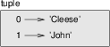
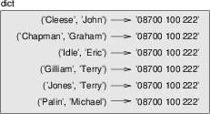

******
Tuples
******

Tuples are immutable
--------------------

A tuple is a sequence of values. The values can be any type, and they
are indexed by integers, so in that respect tuples are a lot like lists.
The important difference is that *tuples are immutable*.

Syntactically, a tuple is a comma-separated list of values:

.. code-block:: python

    >>> t = 'a', 'b', 'c', 'd', 'e'

Although it is not necessary, it is common to enclose tuples in
parentheses:

.. code-block:: python

    >>> t = ('a', 'b', 'c', 'd', 'e')

To create a tuple with a single element, you have to include a final
comma:

.. code-block:: python

    >>> t1 = 'a',
    >>> type(t1)
    <type 'tuple'>

A value in parentheses is not a tuple:

.. code-block:: python

    >>> t2 = ('a')
    >>> type(t2)
    <type 'str'>

Another way to create a tuple is the built-in function ``tuple``. With
no argument, it creates an empty tuple:

.. code-block:: python

    >>> t = tuple()
    >>> print t
    ()

If the argument is a sequence (string, list or tuple), the result is a
tuple with the elements of the sequence:

.. code-block:: python

    >>> t = tuple('lupins')
    >>> print t
    ('l', 'u', 'p', 'i', 'n', 's')

Because ``tuple`` is the name of a built-in function, you should avoid
using it as a variable name.

Most list operators also work on tuples. The bracket operator is used to
index an element:

.. code-block:: python

    >>> t = ('a', 'b', 'c', 'd', 'e')
    >>> print t[0]
    'a'

And the slice operator selects a range of elements.

.. code-block:: python

    >>> print t[1:3]
    ('b', 'c')

But if you try to modify one of the elements of the tuple, you get an
error:

.. code-block:: python

    >>> t[0] = 'A'
    TypeError: object doesn't support item assignment

You can't modify the elements of a tuple, but you can replace one tuple
with another:

.. code-block:: python

    >>> t = ('A',) + t[1:]
    >>> print t
    ('A', 'b', 'c', 'd', 'e')

Tuple assignment
----------------

It is often useful to swap the values of two variables. With
conventional assignments, you have to use a temporary variable. For
example, to swap ``a`` and ``b``:

.. code-block:: python

    >>> temp = a
    >>> a = b
    >>> b = temp

This solution is cumbersome; **tuple assignment** is more elegant:

.. code-block:: python

    >>> a, b = b, a

The left side is a tuple of variables; the right side is a tuple of
expressions. Each value is assigned to its respective variable. All the
expressions on the right side are evaluated before any of the
assignments.

The number of variables on the left and the number of values on the
right have to be the same:

.. code-block:: python

    >>> a, b = 1, 2, 3
    ValueError: too many values to unpack

More generally, the right side can be any kind of sequence (string, list
or tuple). For example, to split an email address into a user name and a
domain, you could write:

.. code-block:: python

    >>> addr = 'monty@python.org'
    >>> uname, domain = addr.split('@')

The return value from ``split`` is a list with two elements; the first
element is assigned to ``uname``, the second to ``domain``.

.. code-block:: python

    >>> print uname
    monty
    >>> print domain
    python.org

Tuples as return values
-----------------------

Strictly speaking, a function can only return one value, but if the
value is a tuple, the effect is the same as returning multiple values.
For example, if you want to divide two integers and compute the quotient
and remainder, it is inefficient to compute ``x/y`` and then ``x%y``. It
is better to compute them both at the same time.

The built-in function ``divmod`` takes two arguments and returns a tuple
of two values, the quotient and remainder. You can store the result as a
tuple:

.. code-block:: python

    >>> t = divmod(7, 3)
    >>> print t
    (2, 1)

Or use tuple assignment to store the elements separately:

.. code-block:: python

    >>> quot, rem = divmod(7, 3)
    >>> print quot
    2
    >>> print rem
    1

Here is an example of a function that returns a tuple:

.. code-block:: python

    def min_max(t):
        return min(t), max(t)

``max`` and ``min`` are built-in functions that find the largest and
smallest elements of a sequence. ``min_max`` computes both and returns a
tuple of two values.

Variable-length argument tuples
-------------------------------

Functions can take a variable number of arguments. A parameter name that
begins with ``*`` **gathers** arguments into a tuple. For example,
``printall`` takes any number of arguments and prints them:

.. code-block:: python

    def printall(*args):
        print args

The gather parameter can have any name you like, but ``args`` is
conventional. Here's how the function works:

.. code-block:: python

    >>> printall(1, 2.0, '3')
    (1, 2.0, '3')

The complement of gather is **scatter**. If you have a sequence of
values and you want to pass it to a function as multiple arguments, you
can use the ``*`` operator. For example, ``divmod`` takes exactly two
arguments; it doesn't work with a tuple:

.. code-block:: python

    >>> t = (7, 3)
    >>> divmod(t)
    TypeError: divmod expected 2 arguments, got 1

But if you scatter the tuple, it works:

.. code-block:: python

    >>> divmod(*t)
    (2, 1)

..

    **Example**:

    1. Many of the built-in functions use variable-length argument
       tuples. For example, ``max`` and ``min`` can take any number of
       arguments::

           >>> max(1,2,3)
           3

       But ``sum`` does not::

           >>> sum(1,2,3)
           TypeError: sum expected at most 2 arguments, got 3

       Write a function called ``sumall`` that takes any number of
       arguments and returns their sum.

Lists and tuples
----------------

``zip`` is a built-in function that takes two or more sequences and
"zips" them into a list [1]_ of tuples where each tuple contains one
element from each sequence.

This example zips a string and a list:

.. code-block:: python

    >>> s = 'abc'
    >>> t = [0, 1, 2]
    >>> zip(s, t)
    [('a', 0), ('b', 1), ('c', 2)]

The result is a list of tuples where each tuple contains a character
from the string and the corresponding element from the list.

If the sequences are not the same length, the result has the length of
the shorter one.

.. code-block:: python

    >>> zip('Anne', 'Elk')
    [('A', 'E'), ('n', 'l'), ('n', 'k')]

You can use tuple assignment in a ``for`` loop to traverse a list of
tuples:

.. code-block:: python

    t = [('a', 0), ('b', 1), ('c', 2)]
    for letter, number in t:
        print number, letter

Each time through the loop, Python selects the next tuple in the list
and assigns the elements to ``letter`` and ``number``. The output of
this loop is:

.. code-block:: python

    0 a
    1 b
    2 c

If you combine ``zip``, ``for`` and tuple assignment, you get a useful
idiom for traversing two (or more) sequences at the same time. For
example, ``has_match`` takes two sequences, ``t1`` and ``t2``, and
returns ``True`` if there is an index ``i`` such that
``t1[i] == t2[i]``:

.. code-block:: python

    def has_match(t1, t2):
        for x, y in zip(t1, t2):
            if x == y:
                return True
        return False

If you need to traverse the elements of a sequence and their indices,
you can use the built-in function ``enumerate``:

.. code-block:: python

    for index, element in enumerate('abc'):
        print index, element

The output of this loop is:

.. code-block:: python

    0 a
    1 b
    2 c

Again.

Dictionaries and tuples
-----------------------

Dictionaries have a method called ``items`` that returns a list of
tuples, where each tuple is a key-value pair [2]_.

.. code-block:: python

    >>> d = {'a':0, 'b':1, 'c':2}
    >>> t = d.items()
    >>> print t
    [('a', 0), ('c', 2), ('b', 1)]

As you should expect from a dictionary, the items are in no particular
order.

Conversely, you can use a list of tuples to initialize a new dictionary:

.. code-block:: python

    >>> t = [('a', 0), ('c', 2), ('b', 1)]
    >>> d = dict(t)
    >>> print d
    {'a': 0, 'c': 2, 'b': 1}

Combining ``dict`` with ``zip`` yields a concise way to create a
dictionary:

.. code-block:: python

    >>> d = dict(zip('abc', range(3)))
    >>> print d
    {'a': 0, 'c': 2, 'b': 1}

The dictionary method ``update`` also takes a list of tuples and adds
them, as key-value pairs, to an existing dictionary.

Combining ``items``, tuple assignment and ``for``, you get the idiom for
traversing the keys and values of a dictionary:

.. code-block:: python

    for key, val in d.items():
        print val, key

The output of this loop is:

.. code-block:: python

    0 a
    2 c
    1 b

Again.

It is common to use tuples as keys in dictionaries (primarily because
you can't use lists). For example, a telephone directory might map from
last-name, first-name pairs to telephone numbers. Assuming that we have
defined ``last``, ``first`` and ``number``, we could write:

.. code-block:: python

    directory[(last,first)] = number

The expression in brackets is a tuple. We could use tuple assignment to
traverse this dictionary.

.. code-block:: python

    for last, first in directory:
        print first, last, directory[(last,first)]

This loop traverses the keys in ``directory``, which are tuples. It
assigns the elements of each tuple to ``last`` and ``first``, then
prints the name and corresponding telephone number.

There are two ways to represent tuples in a state diagram. The more
detailed version shows the indices and elements just as they appear in a
list. For example, the tuple ``('Cleese', 'John')`` would appear:

   2-tuple example

But in a larger diagram you might want to leave out the details. For
example, a diagram of the telephone directory might appear:

   Another tuple example

Here the tuples are shown using Python syntax as a graphical shorthand.

The telephone number in the diagram is the complaints line for the BBC,
so please don't call it.

Comparing tuples
----------------

The relational operators work with tuples and other sequences; Python
starts by comparing the first element from each sequence. If they are
equal, it goes on to the next elements, and so on, until it finds
elements that differ. Subsequent elements are not considered (even if
they are really big).

::

    >>> (0, 1, 2) < (0, 3, 4)
    True
    >>> (0, 1, 2000000) < (0, 3, 4)
    True

The ``sort`` function works the same way. It sorts primarily by first
element, but in the case of a tie, it sorts by second element, and so
on.

This feature lends itself to a pattern called **DSU** for

Decorate
    a sequence by building a list of tuples with one or more sort keys
    preceding the elements from the sequence,

Sort
    the list of tuples, and

Undecorate
    by extracting the sorted elements of the sequence.

For example, suppose you have a list of words and you want to sort them
from longest to shortest:

.. code-block:: python

    def sort_by_length(words):
        t = []
        for word in words:
           t.append((len(word), word))

        t.sort(reverse=True)

        res = []
        for length, word in t:
            res.append(word)
        return res

The first loop builds a list of tuples, where each tuple is a word
preceded by its length.

``sort`` compares the first element, length, first, and only considers
the second element to break ties. The keyword argument ``reverse=True``
tells ``sort`` to go in decreasing order.

The second loop traverses the list of tuples and builds a list of words
in descending order of length.

    **Example**:

    In this example, ties are broken by comparing words, so words with
    the same length appear in reverse alphabetical order. For other
    applications you might want to break ties at random. Modify this
    example so that words with the same length appear in random order.
    Hint: see the ``random`` function in the ``random`` module.

Sequences of sequences
----------------------

I have focused on lists of tuples, but almost all of the examples in
this chapter also work with lists of lists, tuples of tuples, and tuples
of lists. To avoid enumerating the possible combinations, it is
sometimes easier to talk about sequences of sequences.

In many contexts, the different kinds of sequences (strings, lists and
tuples) can be used interchangeably. So how and why do you choose one
over the others?

To start with the obvious, strings are more limited than other sequences
because the elements have to be characters. They are also immutable. If
you need the ability to change the characters in a string (as opposed to
creating a new string), you might want to use a list of characters
instead.

Lists are more common than tuples, mostly because they are mutable. But
there are a few cases where you might prefer tuples:

1. In some contexts, like a ``return`` statement, it is syntactically
   simpler to create a tuple than a list. In other contexts, you might
   prefer a list.

2. If you want to use a sequence as a dictionary key, you have to use an
   immutable type like a tuple or string.

3. If you are passing a sequence as an argument to a function, using
   tuples reduces the potential for unexpected behavior due to aliasing.

Because tuples are immutable, they don't provide methods like ``sort``
and ``reverse``, which modify existing lists. But Python provides the
built-in functions ``sorted`` and ``reversed``, which take any sequence
as a parameter and return a new list with the same elements in a
different order.

Debugging
---------

Lists, dictionaries and tuples are known generically as **data
structures**; in this chapter we are starting to see compound data
structures, like lists of tuples, and dictionaries that contain tuples
as keys and lists as values. Compound data structures are useful, but
they are prone to what I call **shape errors**; that is, errors caused
when a data structure has the wrong type, size or composition. For
example, if you are expecting a list with one integer and I give you a
plain old integer (not in a list), it won't work.

A strategy for ferreting out such problems is to use the ``assert``
function discussed earlier to test the shape of data structures that are
passed in to functions. Python includes a function called ``isinstance``
that can test whether a variable is an instance of a particular data
type. You can compose that with ``assert`` to ensure that the data types
your function receives are what you expect.

.. code-block:: python

    >>> x = []
    >>> isinstance(x, list)
    True
    >>> y = {}
    >>> assert(isinstance(y, list))
    Traceback (most recent call last):
      File "<stdin>", line 1, in <module>
    AssertionError    

If you create assertions like this and they fail, you know that one of
the parameters to a function is of the wrong shape. You can then search
for instances where the function is called to find and fix situations in
which the function is called incorrectly.

.. rubric:: Glossary

tuple:
    An immutable sequence of elements.

tuple assignment:
    An assignment with a sequence on the right side and a tuple of
    variables on the left. The right side is evaluated and then its
    elements are assigned to the variables on the left.

gather:
    The operation of assembling a variable-length argument tuple.

scatter:
    The operation of treating a sequence as a list of arguments.

DSU:
    Abbreviation of “decorate-sort-undecorate,” a pattern that involves
    building a list of tuples, sorting, and extracting part of the
    result.

data structure:
    A collection of related values, often organized in lists,
    dictionaries, tuples, etc.

shape (of a data structure):
    A summary of the type, size and composition of a data structure.

.. rubric:: Exercises

1. Write a function called ``most_frequent`` that takes a string and
   prints the letters in decreasing order of frequency. Find text
   samples from several different languages and see how letter
   frequency varies between languages. Compare your results with the
   tables at http://wikipedia.org/wiki/Letter_frequencies.

2. Write a program that reads a word list from a file (see `this
   section <#sec:wordlist>`_) and prints all the sets of words that
   are anagrams.

   Here is an example of what the output might look like::

       ['deltas', 'desalt', 'lasted', 'salted', 'slated', 'staled']
       ['retainers', 'ternaries']
       ['generating', 'greatening']
       ['resmelts', 'smelters', 'termless']

   Hint: you might want to build a dictionary that maps from a set
   of letters to a list of words that can be spelled with those
   letters. The question is, how can you represent the set of
   letters in a way that can be used as a key?

3. Modify the previous program so that it prints the largest set of
   anagrams first, followed by the second largest set, and so on.

4. In Scrabble, a "bingo" is when you play all seven tiles in your
   rack along with a letter on the board to form an eight-letter
   word. What set of 8 letters forms the most possible bingos? Hint:
   there are seven.

5. Two words form a "metathesis pair" if you can transform one into
   the other by swapping two letters [3]_; for example, “converse”
   and “conserve.” Write a program that finds all of the metathesis
   pairs in the dictionary. Hint: don’t test all pairs of words, and
   don’t test all possible swaps.

6. Here’s another Car Talk Puzzler [4]_:

   "What is the longest English word, that remains a valid English
   word, as you remove its letters one at a time?

   "Now, letters can be removed from either end, or the middle, but
   you can’t rearrange any of the letters. Every time you drop a
   letter, you wind up with another English word. If you do that,
   you’re eventually going to wind up with one letter and that too
   is going to be an English word—one that’s found in the
   dictionary. I want to know what’s the longest word and how many
   letters does it have?

   I’m going to give you a little modest example: Sprite. Ok? You
   start off with sprite, you take a letter off, one from the
   interior of the word, take the r away, and we’re left with the
   word spite, then we take the e off the end, we’re left with spit,
   we take the s off, we’re left with pit, it, and I."

   Write a program to find all words that can be reduced in this
   way, and then find the longest one.

   This exercise is a little more challenging than most, so here are
   some suggestions:

   -  You might want to write a function that takes a word and
      computes a list of all the words that can be formed by
      removing one letter. These are the “children” of the word.

   -  Recursively, a word is reducible if any of its children are
      reducible. As a base case, you can consider the empty string
      reducible.

   -  The wordlist I provided, ``words.txt``, doesn’t contain single
      letter words. So you might want to add “I”, “a”, and the empty
      string.

   -  To improve the performance of your program, you might want to
      memoize the words that are known to be reducible.

.. rubric:: Footnotes

.. [1]
   In Python 3.0, ``zip`` returns an iterator of tuples, but for most
   purposes, an iterator behaves like a list.

.. [2]
   This behavior is slightly different in Python 3.0.

.. [3]
   This exercise is inspired by an example at http://puzzlers.org.

.. [4]
   http://www.cartalk.com/content/puzzler/transcripts/200651
