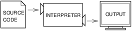
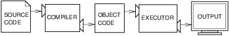
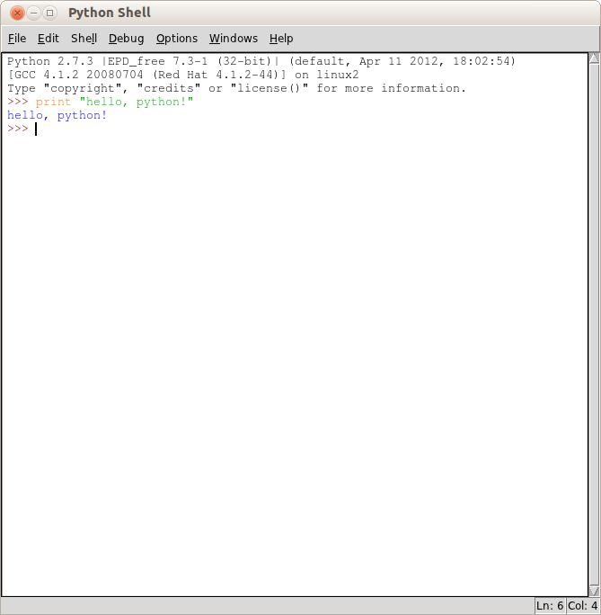
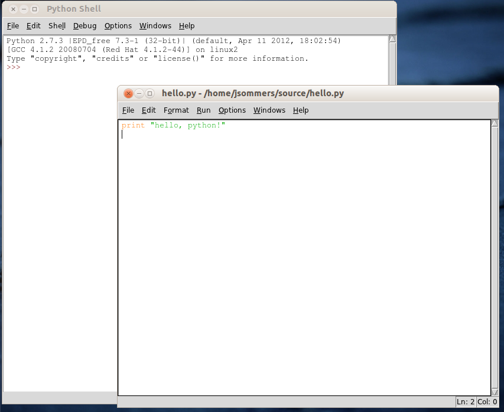

The way of the program
**********************

The goal of this book is to teach you to think like a computer
scientist. This way of thinking combines some of the best features of
mathematics, engineering, and natural science. Like mathematicians,
computer scientists use formal languages to denote ideas (specifically
computations). Like engineers, they design things, assembling components
into systems and evaluating tradeoffs among alternatives. Like
scientists, they observe the behavior of complex systems, form
hypotheses, and test predictions.

The single most important skill for a computer scientist is **problem
solving**. Problem solving means the ability to formulate problems,
think creatively about solutions, and express a solution clearly and
accurately. As it turns out, the process of learning to program is an
excellent opportunity to practice problem-solving skills. That's why
this chapter is called, "The way of the program."

On one level, you will be learning to program, a useful skill by itself.
On another level, you will use programming as a means to an end. As we
go along, that end will become clearer.

The Python programming language
===============================

The programming language you will learn is Python. Python is an example
of a **high-level language**; other high-level languages you might have
heard of are C, C++, Perl, and Java.

There are also **low-level languages**, sometimes referred to as
"machine languages" or "assembly languages." Loosely speaking, computers
can only execute programs written in low-level languages. So programs
written in a high-level language have to be processed before they can
run. This extra processing takes some time, which is a small
disadvantage of high-level languages.

The advantages are enormous. First, it is much easier to program in a
high-level language. Programs written in a high-level language take less
time to write, they are shorter and easier to read, and they are more
likely to be correct. Second, high-level languages are **portable**,
meaning that they can run on different kinds of computers with few or no
modifications. Low-level programs can run on only one kind of computer
and have to be rewritten to run on another.

Due to these advantages, almost all programs are written in high-level
languages. Low-level languages are used only for a few specialized
applications.

Two kinds of programs process high-level languages into low-level
languages: **interpreters** and **compilers**. An interpreter reads a
high-level program and executes it, meaning that it does what the
program says. It processes the program a little at a time, alternately
reading lines and performing computations.

   Running an "interpreted" program.

A compiler reads the program and translates it completely before the
program starts running. In this context, the high-level program is
called the **source code**, and the translated program is called the
**object code** or the **executable**. Once a program is compiled, you
can execute it repeatedly without further translation.

   Running a "compiled" program.

Python is considered an interpreted language because Python programs are
executed by an interpreter. There are two ways to use the interpreter:
**interactive mode** and **script mode**. In interactive mode, you type
Python programs and the interpreter prints the result:

.. code-block:: python

    >>> 1 + 1
    2

The chevron, ``>>>``, is the **prompt** the interpreter uses to indicate
that it is ready. If you type ``1 + 1``, the interpreter replies ``2``.

Alternatively, you can store code in a file and use the interpreter to
execute the contents of the file, which is called a **script**. By
convention, Python scripts have names that end with ``.py``.

In this course, we'll typically be writing programs within a text editor

program called IDLE. A screenshot of IDLE is shown below. (Note that
this screenshot was taken on a Linux system, and that one Python
statement was executed in the interpreter after starting it up. On your
own computer, the window may look slightly different.)

.. todo:: fix this discussion about IDLE; need to update screenshots for Py3k

   Main IDLE window (the "shell").

This window is what you'll see once IDLE first starts up. This window is
also referred to as the "shell". All that means is that it is this
window in which you can directly interact with the Python interpreter.
We'll frequently use this window to experiment with different Python
statements and expressions and for very short (1--2 line) programs. For
anything more than a few lines, you should write and save your program
as a "script". To create a script using IDLE, simply go to the File menu
and select "New window". In the window that opens, you can type your
program. To execute (run) the program, you can go to the "Run" menu and
select "Run module". The screenshot below shows IDLE with a 1-line
script. Again, IDLE running on other computer systems may look slightly
different.

   IDLE with a script window.

There are other ways to execute Python scripts. For example, you can
open a terminal window and type ``python myprogram.py`` (assuming you
saved a script in the file ``myprogram.py``). The details of opening a
terminal window and executing Python scripts in this way vary among
different operating systems (e.g., Linux, MacOS X, Windows, etc.).
Normally, we will just be using IDLE in this course.

You are strongly encouraged to install Python on your own personal
computer --- it's free! There are two options for installing Python: the
official package at python.org, and a package with a few additional (and
useful) libraries at enthought.com. These are available at
http://www.python.org/download/ and http://enthought.com/repo/free/. It
is recommended that you install the Enthought version, since different
class exercises may make use of the additional libraries available with
this distribution.

What is a program?
==================

A **program** is a sequence of instructions that specifies how to
perform a computation. The computation might be something mathematical,
such as solving a system of equations or finding the roots of a
polynomial, but it can also be a symbolic computation, such as searching
and replacing text in a document or (strangely enough) compiling a
program.

The details look different in different languages, but a few basic
instructions appear in just about every language:

input:
    Get data from the keyboard, a file, or some other device.

output:
    Display data on the screen or send data to a file or other device.

math:
    Perform basic mathematical operations like addition and
    multiplication.

conditional execution:
    Check for certain conditions and execute the appropriate sequence of
    statements.

repetition:
    Perform some action repeatedly, usually with some variation.

Believe it or not, that's pretty much all there is to it. Every program
you've ever used, no matter how complicated, is made up of instructions
that look pretty much like these. So you can think of programming as
*the process of breaking a large, complex task into smaller and smaller
subtasks until the subtasks are simple enough to be performed with one
of these basic instructions*.

That may be a little vague, but we will come back to this topic when we
talk about **algorithms**.

What is debugging?
==================

Programming is error-prone. For whimsical reasons, programming errors
are called **bugs** and the process of tracking them down is called
**debugging**. Interestingly, one of the original uses of the term "bug"
actually had to do with insects: an error in an early computer system
was traced to a problem caused by a moth trapped in an electronic
circuit! An early computer pioneer, Grace Hopper, is credited with
having coined the term (`read more about Grace Hopper on
Wikipedia <http://en.wikipedia.org/wiki/Grace_Hopper>`_).

Three kinds of errors can occur in a program: syntax errors, runtime
errors, and semantic errors. It is useful to distinguish between them in
order to track them down more quickly.

Syntax errors
-------------

Python can only execute a program if the syntax is correct; otherwise,
the interpreter displays an error message. **Syntax** refers to the
structure of a program and the rules about that structure. For example,
parentheses have to come in matching pairs, so ``(1 + 2)`` is legal, but
``8)`` is a **syntax error**.

In English readers can tolerate most syntax errors, which is why we can
read the poetry of e. e. cummings without spewing error messages. Python
is not so forgiving. If there is a single syntax error anywhere in your
program, Python will display an error message and quit, and you will not
be able to run your program. During the first few weeks of your
programming career, you will probably spend a lot of time tracking down
syntax errors. As you gain experience, you will make fewer errors and
find them faster.

Runtime errors
--------------

The second type of error is a runtime error, so called because the error
does not appear until after the program has started running. These
errors are also called **exceptions** because they usually indicate that
something exceptional (and bad) has happened.

Runtime errors are rare in the simple programs you will see in the first
few chapters, so it might be a while before you encounter one.

Semantic errors
---------------

The third type of error is the **semantic error**. If there is a
semantic error in your program, it will run successfully in the sense
that the computer will not generate any error messages, but it will not
do the right thing. It will do something else. Specifically, it will do
what you told it to do.

The problem is that the program you wrote is not the program you wanted
to write. The meaning (semantics) of the program is wrong. Identifying
semantic errors can be tricky because it requires you to work backward
by looking at the output of the program and trying to figure out what it
is doing.

Experimental debugging
----------------------

One of the most important skills you will acquire is debugging. Although
it can be frustrating, debugging is one of the most intellectually rich,
challenging, and interesting parts of programming.

In some ways, debugging is like detective work. You are confronted with
clues, and you have to infer the processes and events that led to the
results you see.

Debugging is also like an experimental science. Once you have an idea
about what is going wrong, you modify your program and try again. If
your hypothesis was correct, then you can predict the result of the
modification, and you take a step closer to a working program. If your
hypothesis was wrong, you have to come up with a new one. As Sherlock
Holmes pointed out, "When you have eliminated the impossible, whatever
remains, however improbable, must be the truth." (A. Conan Doyle, *The
Sign of Four*)

For some people, programming and debugging are the same thing. That is,
programming is the process of gradually debugging a program until it
does what you want. The idea is that you should start with a program
that does *something* and make small modifications, debugging them as
you go, so that you always have a working program.

For example, Linux is an operating system that contains thousands of
lines of code, but it started out as a simple program Linus Torvalds
used to explore the Intel 80386 chip. According to Larry Greenfield,
"One of Linus's earlier projects was a program that would switch between
printing AAAA and BBBB. This later evolved to Linux." (*The Linux
Users's Guide* Beta Version 1).

Later chapters will make more suggestions about debugging, creating
"tests" to ensure that your programs behave as expected, and other
programming practices.

Formal and natural languages
============================

**Natural languages** are the languages people speak, such as English,
Spanish, and French. They were not designed by people (although people
try to impose some order on them); they evolved naturally.

**Formal languages** are languages that are designed by people for
specific applications. For example, the notation that mathematicians use
is a formal language that is particularly good at denoting relationships
among numbers and symbols. Chemists use a formal language to represent
the chemical structure of molecules. And most importantly:

    **Programming languages are formal languages that have been designed
    to express computations.**

Formal languages tend to have strict rules about syntax. For example,
``3 + 3 = 6`` is a syntactically correct mathematical statement, but
``3 + = 3 $ 6`` is not. H\ :sub:`2`\ O is a syntactically correct
chemical formula, but :sub:`2`\ Zz is not.

Syntax rules come in two flavors, pertaining to *tokens* and structure.
Tokens are the basic elements of the language, such as words, numbers,
and chemical elements. One of the problems with ``3 + = 3 $ 6`` is that
``$`` is not a legal token in mathematics (at least as far as I know).
Similarly, :sub:`2`\ Zz is not legal because there is no element with
the abbreviation ``Zz``.

The second type of syntax error pertains to the structure of a
statement; that is, the way the tokens are arranged. The statement
``3 + = 3 $ 6`` is illegal because even though ``+`` and ``=`` are legal
tokens, you can't have one right after the other. Similarly, in a
chemical formula the subscript comes after the element name, not before.

    **Example**:

    1. Write a well-structured English sentence with invalid tokens in
       it. Then write another sentence with all valid tokens but with
       invalid structure.

When you read a sentence in English or a statement in a formal language,
you have to figure out what the structure of the sentence is (although
in a natural language you do this subconsciously). This process is
called **parsing**.

For example, when you hear the sentence, "The penny dropped," you
understand that "the penny" is the subject and "dropped" is the
predicate. Once you have parsed a sentence, you can figure out what it
means, or the semantics of the sentence. Assuming that you know what a
penny is and what it means to drop, you will understand the general
implication of this sentence.

Although formal and natural languages have many features in common ---
tokens, structure, syntax, and semantics --- there are some differences:

ambiguity:
    Natural languages are full of ambiguity, which people deal with by
    using contextual clues and other information. Formal languages are
    designed to be nearly or completely unambiguous, which means that
    any statement has exactly one meaning, regardless of context.

redundancy:
    In order to make up for ambiguity and reduce misunderstandings,
    natural languages employ lots of redundancy. As a result, they are
    often verbose. Formal languages are less redundant and more concise.

literalness:
    Natural languages are full of idiom and metaphor. If I say, "The
    penny dropped," there is probably no penny and nothing
    dropping. [1]_ Formal languages mean exactly what they say.

    People who grow up speaking a natural language (everyone!) often
    have a hard time adjusting to formal languages. In some ways, the
    difference between formal and natural language is like the
    difference between poetry and prose, but more so:

Poetry:
    Words are used for their sounds as well as for their meaning, and
    the whole poem together creates an effect or emotional response.
    Ambiguity is not only common but often deliberate.

Prose:
    The literal meaning of words is more important, and the structure
    contributes more meaning. Prose is more amenable to analysis than
    poetry but still often ambiguous.

Programs:
    The meaning of a computer program is unambiguous and literal, and
    can be understood entirely by analysis of the tokens and structure.

Here are some suggestions for reading programs (and other formal
languages). First, remember that formal languages are much more dense
than natural languages, so it takes longer to read them. Also, the
structure is very important, so it is usually not a good idea to read
from top to bottom, left to right. Instead, learn to parse the program
in your head, identifying the tokens and interpreting the structure.
Finally, the details matter. Small errors in spelling and punctuation,
which you can get away with in natural languages, can make a big
difference in a formal language.

The first program
=================

Traditionally, the first program you write in a new language is called
"Hello, World!" because all it does is display the words, "Hello,
World!" In Python, it looks like this:

.. code-block:: python

    print ('Hello, World!')

This is an example of a **print function**, which doesn't
actually print anything on paper. It displays a value on the screen. In
this case, the result is the words

.. code-block:: python

    Hello, World!

The quotation marks in the program mark the beginning and end of the
text to be displayed; they don't appear in the result.

Some people judge the quality of a programming language by the
simplicity of the "Hello, World!" program. By this standard, Python does
about as well as possible.

Debugging
=========

It is a good idea to read this book in front of a computer so you can
try out the examples as you go. You can run most of the examples in
interactive mode, but if you put the code into a script, it is easier to
try out variations.

    **Example**:

    1. Whenever you are experimenting with a new feature, you should try
       to make mistakes. In the "Hello, world!" program, what happens if
       you leave out one of the quotation marks? What if you leave out
       both? What if you spell ``print`` wrong?

This kind of experiment helps you remember what you read; it also helps
with debugging, because you get to know what the error messages mean. It
is better to make mistakes now and on purpose than later and
accidentally.

Programming, and especially debugging, sometimes brings out strong
emotions. If you are struggling with a difficult bug, you might feel
angry, despondent or embarrassed.

There is evidence that people naturally respond to computers as if they
were people[2]_.  When they work well, we think of them as teammates,
and when they are obstinate or rude, we respond to them the same way we
respond to rude, obstinate people.

Preparing for these reactions might help you deal with them. One
approach is to think of the computer as an employee with certain
strengths, like speed and precision, and particular weaknesses, like
lack of empathy and inability to grasp the big picture.

Your job is to be a good manager: find ways to take advantage of the
strengths and mitigate the weaknesses. And find ways to use your
emotions to engage with the problem, without letting your reactions
interfere with your ability to work effectively.

Learning to debug can be frustrating, but it is a valuable skill that is
useful for many activities beyond programming. At the end of each
chapter there is a debugging section, like this one, with my thoughts
about debugging. I hope they help!

Glossary
========

problem solving:
    The process of formulating a problem, finding a solution, and
    expressing the solution.

high-level language:
    A programming language like Python that is designed to be easy for
    humans to read and write.

low-level language:
    A programming language that is designed to be easy for a computer to
    execute; also called *machine language* or *assembly language*.

portability:
    A property of a program that can run on more than one kind of
    computer.

interpret:
    To execute a program in a high-level language by translating it one
    line at a time.

compile:
    To translate a program written in a high-level language into a
    low-level language all at once, in preparation for later execution.

source code:
    A program in a high-level language before being compiled.

object code:
    The output of the compiler after it translates the program.

executable:
    Another name for object code that is ready to be executed.

prompt:
    Characters displayed by the interpreter to indicate that it is ready
    to take input from the user.

script:
    A program stored in a file (usually one that will be interpreted).

interactive mode:
    A way of using the Python interpreter by typing commands and
    expressions at the prompt.

script mode:
    A way of using the Python interpreter to read and execute statements
    in a script.

program:
    A set of instructions that specifies a computation.

algorithm:
    A general process for solving a category of problems.

bug:
    An error in a program.

debugging:
    The process of finding and removing any of the three kinds of
    programming errors.

syntax:
    The structure of a program.

syntax error:
    An error in a program that makes it impossible to parse (and
    therefore impossible to interpret).

exception:
    An error that is detected while the program is running.

semantics:
    The meaning of a program.

semantic error:
    An error in a program that makes it do something other than what the
    programmer intended.

natural language:
    Any one of the languages that people speak that evolved naturally.

formal language:
    Any one of the languages that people have designed for specific
    purposes, such as representing mathematical ideas or computer
    programs; all programming languages are formal languages.

token:
    One of the basic elements of the syntactic structure of a program,
    analogous to a word in a natural language.

parse:
    To examine a program and analyze the syntactic structure.

print statement:
    An instruction that causes the Python interpreter to display a value
    on the screen.

.. rubric:: Exercises

1. Ways to get help in Python. These two quasi-exercises show you
   ways in which you can get help on different statements and
   operations in Python.

   a. Use a web browser to go to the Python website
      http://python.org. This page contains information about Python
      and links to Python-related pages, and it gives you the
      ability to search the Python documentation.

      For example, if you enter ``print`` in the search window, the
      first link that appears is the documentation of the ``print``
      statement. At this point, not all of it will make sense to
      you, but it is good to know where it is.

   b. Start the Python interpreter and type ``help()`` to start the
      online help utility. Or you can type ``help('print')`` to get
      information about the ``print`` statement.

2. Start the Python interpreter and use it as a calculator. Python's
   syntax for math operations is almost the same as standard
   mathematical notation. For example, the symbols ``+``, ``-`` and
   ``/`` denote addition, subtraction and division, as you would
   expect. The symbol for multiplication is ``*``.

   a. If you run a 10 kilometer race in 43 minutes 30 seconds, what
      is your average time per mile? What is your average speed in
      miles per hour? (Hint: there are 1.61 kilometers in a mile).

   b. How many seconds are there in 8 weeks? Write a one-line Python
      program to print the answer.

.. [1]
   This idiom means that someone realized something after a period of
   confusion.

.. [2]
   See Reeves and Nass, *The Media Equation: How People Treat Computers,
   Television, and New Media Like Real People and Places*.
